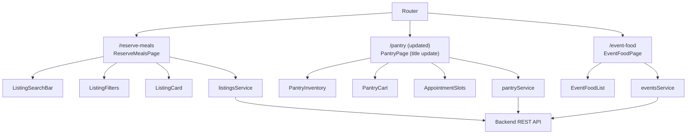

# Design Document: Category Pages

## Overview

Three dedicated category pages — **Reserve Surplus Meals**, **Pantry Access**, and **Event Food** — are added to the FoodBridge React frontend. Each page is a focused, purpose-built view that reuses existing shared components (ListingCard, ListingFilters, PantryInventory, PantryCart, AppointmentSlots, EventFoodList) while adding a branded hero section with title and description. The pages are registered as new routes and linked from the Navigation component for student users.

The existing `ListingsPage`, `PantryPage`, and `EventsPage` remain unchanged. The new category pages are additive.

---

## Architecture



The three pages follow the same data-fetching pattern already established in the codebase:
1. `useEffect` on mount triggers async fetch(es)
2. Loading state drives `LoadingSpinner`
3. Error state drives `Toast`
4. Data state drives component rendering

---

## Components and Interfaces

### New Pages

#### `ReserveMealsPage` (`src/pages/ReserveMealsPage.tsx`)

Wraps the existing listings fetch + filter + infinite scroll logic, scoped to `listing_type=donation`. Renders a hero section, search bar, filter sidebar (hidden on mobile), and a `ListingCard` grid.

```typescript
// Props: none (reads auth from AuthContext)
// Route: /reserve-meals
```

Key state:
```typescript
listings: Listing[]
isLoading: boolean
searchQuery: string
filters: FilterState
currentPage: number
hasMore: boolean
totalCount: number
```

#### `EventFoodPage` (`src/pages/EventFoodPage.tsx`)

Fetches event food listings (`listing_type=event`) and renders them via the existing `EventFoodList` component. Adds a hero section with title and description.

```typescript
// Props: none
// Route: /event-food
```

Key state:
```typescript
eventFood: Listing[]
isLoading: boolean
```

#### `PantryPage` (updated title/description in `src/pages/PantryPage.tsx`)

The existing `PantryPage` already implements all required pantry functionality. The only change is updating the page title to "Pantry Access" and adding the full introductory description paragraph.

### Updated Components

#### `Navigation` (`src/components/shared/Navigation.tsx`)

Add links to `/reserve-meals` and `/event-food` for student users. The existing `/pantry` link remains. The new links follow the existing `navLinkStyle` / `navLinkClass` pattern.

### Reused Components (no changes)

| Component | Used by |
|---|---|
| `ListingCard` | ReserveMealsPage |
| `ListingFilters` | ReserveMealsPage |
| `ListingSearchBar` | ReserveMealsPage |
| `EventFoodList` | EventFoodPage |
| `PantryInventory` | PantryPage (existing) |
| `PantryCart` | PantryPage (existing) |
| `AppointmentSlots` | PantryPage (existing) |
| `LoadingSpinner` | All three pages |
| `Toast` / `useToast` | All three pages |

---

## Data Models

These pages consume existing API types — no new data models are introduced.

```typescript
// From src/types/listings.ts (existing)
interface Listing {
  listing_id: string;
  food_name: string;
  description?: string;
  listing_type: 'donation' | 'event' | 'dining_deal';
  available_quantity: number;
  quantity: number;
  location: string;
  pickup_window_start: string;
  pickup_window_end: string;
  dietary_tags: string[];
  provider_id: string;
  image_url?: string;
}

interface FilterState {
  dietary: string[];
  location: string;
  food_type: string;
}

interface ListingQueryParams {
  page: number;
  limit: number;
  search?: string;
  dietary?: string[];
  location?: string;
  food_type?: string;
}
```

`ReserveMealsPage` passes `food_type: 'donation'` in `ListingQueryParams` to scope results. `EventFoodPage` passes `food_type: 'event'`.

---

## Correctness Properties

*A property is a characteristic or behavior that should hold true across all valid executions of a system — essentially, a formal statement about what the system should do. Properties serve as the bridge between human-readable specifications and machine-verifiable correctness guarantees.*

### Property 1: Donation filter invariant

*For any* set of listings returned by `ReserveMealsPage`, every listing in the rendered grid must have `listing_type === 'donation'`.

**Validates: Requirements 3.3**

---

### Property 2: Event food filter invariant

*For any* set of listings returned by `EventFoodPage`, every listing in the rendered grid must have `listing_type === 'event'`.

**Validates: Requirements 9.3**

---

### Property 3: Cart add idempotence / accumulation

*For any* pantry item already present in the cart, adding it again with quantity `q` must result in the cart item's quantity increasing by exactly `q` — the cart must never contain duplicate entries for the same `item_id`.

**Validates: Requirements 6.1, 6.2**

---

### Property 4: Cart remove completeness

*For any* cart state, removing an item by `item_id` must result in a cart that contains no entry with that `item_id`.

**Validates: Requirements 6.3**

---

### Property 5: Zero-quantity removal

*For any* cart item, updating its quantity to 0 must produce the same cart state as explicitly removing that item — the item must not appear in the resulting cart.

**Validates: Requirements 6.4**

---

### Property 6: Sold-out button disabled invariant

*For any* listing with `available_quantity === 0`, the rendered `ListingCard` must not contain an enabled reserve button.

**Validates: Requirements 3.5**

---

### Property 7: Unauthenticated read-only invariant

*For any* rendered listing card when the current user is `null`, the card must not render a reserve button.

**Validates: Requirements 12.1, 12.3**

---

### Property 8: Provider read-only invariant

*For any* rendered listing card when the current user has `role === 'provider'`, the card must not render a reserve button.

**Validates: Requirements 12.4, 12.5**

---

## Error Handling

| Scenario | Handling |
|---|---|
| Listings API failure on mount | Error Toast + empty state message |
| Pantry inventory API failure | Error Toast + empty inventory state |
| Pantry slots API failure | Error Toast + empty slots state |
| Appointment booking failure | Error Toast with message from API |
| Appointment cancel failure | Error Toast |
| Event food API failure | Error Toast + empty state message |
| Book with no slot selected | Validation Toast before API call |
| Book with empty cart | Validation Toast before API call |

All error handling follows the existing pattern: `try/catch` around service calls, `showToast('...', 'error')` on failure, graceful empty state on initial load failure.

---

## Testing Strategy

### Unit Tests

- `ReserveMealsPage`: renders hero title/description, renders loading spinner, renders empty state, renders listing cards from mock data.
- `EventFoodPage`: renders hero title/description, renders loading spinner, renders empty state.
- `PantryPage` (title update): renders updated title "Pantry Access" and description.
- `Navigation`: renders `/reserve-meals` and `/event-food` links for student users, does not render them for provider users.

### Property-Based Tests (fast-check)

Each correctness property above maps to one property-based test. Tests use fast-check arbitraries to generate random listings, cart states, and user objects.

**Configuration**: minimum 100 runs per property test.

**Tag format**: `Feature: category-pages, Property N: <property_text>`

| Property | Test file | Arbitrary inputs |
|---|---|---|
| P1: Donation filter invariant | `ReserveMealsPage.properties.test.tsx` | `fc.array(fc.record({ listing_type: fc.constantFrom('donation','event','dining_deal'), ... }))` |
| P2: Event food filter invariant | `EventFoodPage.properties.test.tsx` | same shape, `listing_type` varied |
| P3: Cart add accumulation | `categoryPages.cart.properties.test.ts` | `fc.array(cartItem)`, `fc.nat()` for quantity |
| P4: Cart remove completeness | `categoryPages.cart.properties.test.ts` | `fc.array(cartItem)`, `fc.string()` for item_id |
| P5: Zero-quantity removal | `categoryPages.cart.properties.test.ts` | `fc.array(cartItem)` |
| P6: Sold-out disabled | `ListingCard.properties.test.tsx` (extend existing) | `fc.record({ available_quantity: fc.constant(0), ... })` |
| P7: Unauthenticated read-only | `ListingCard.properties.test.tsx` (extend existing) | `fc.record(listing)`, `null` user |
| P8: Provider read-only | `ListingCard.properties.test.tsx` (extend existing) | `fc.record(listing)`, provider user |

Properties P6–P8 extend the existing `ListingCard` property test file since they test `ListingCard` rendering behavior, not page-level logic.
