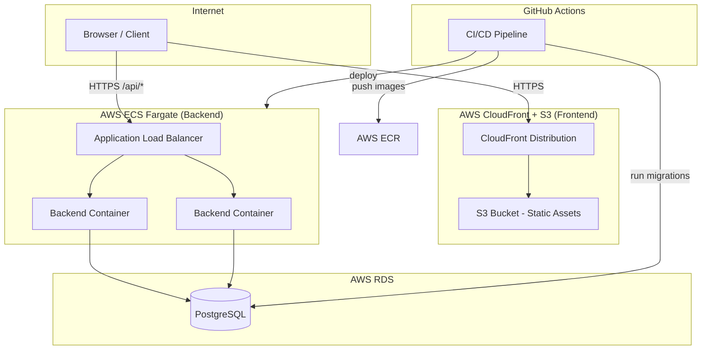

# Design Document: FoodBridge AI Deployment

## Overview

This document describes the production deployment architecture for the FoodBridge AI platform. The system is composed of three services — a React/Vite frontend, a Node.js/Express backend, and a PostgreSQL database — deployed to a cloud environment using Docker containers, a managed database, and a CDN-backed static host. A GitHub Actions CI/CD pipeline automates build, test, migration, and deployment on every push to `main`.

The chosen cloud target is **AWS** (ECS Fargate for the backend, S3 + CloudFront for the frontend, RDS for PostgreSQL), but the design is structured so that GCP or Azure equivalents can be substituted with minimal changes.

---

## Architecture



### Traffic Flow

1. The browser loads the React SPA from CloudFront (served from S3).
2. API calls from the SPA hit the Application Load Balancer over HTTPS.
3. The ALB routes requests to one of the Backend containers running in ECS Fargate.
4. The Backend connects to RDS PostgreSQL over the private VPC network.
5. The ALB terminates TLS using an ACM certificate; HTTP is redirected to HTTPS at the ALB level.

---

## Components and Interfaces

### 1. Frontend Docker Image

- **Base**: `node:20-alpine` (build stage) → `nginx:alpine` (serve stage)
- **Build stage**: Runs `npm ci && npm run build` inside `foodbridge-frontend/`; outputs `dist/`
- **Serve stage**: Copies `dist/` into `/usr/share/nginx/html`; includes a custom `nginx.conf` that:
  - Serves `index.html` for all routes (SPA fallback)
  - Sets cache headers for static assets
  - Proxies `/api/*` to the backend (used only in local `docker-compose` setup)
- **Build arg**: `VITE_API_URL` injected at build time

### 2. Backend Docker Image

- **Base**: `node:20-alpine` (build stage) → `node:20-alpine` (runtime stage)
- **Build stage**: Runs `npm ci && npm run build` inside `backend/`; outputs `dist/`
- **Runtime stage**: Copies `dist/` and `node_modules/` (production only); runs `node dist/index.js`
- **Startup validation**: On boot, the app checks for required env vars and exits with code 1 if any are missing

### 3. docker-compose.yml (Local Integration)

Services: `frontend`, `backend`, `postgres`

```yaml
# Illustrative structure
services:
  postgres:
    image: postgres:16-alpine
    environment: { POSTGRES_DB, POSTGRES_USER, POSTGRES_PASSWORD }
    healthcheck: pg_isready

  backend:
    build: ./backend
    depends_on: [postgres]
    environment: [DB_HOST, DB_PORT, JWT_SECRET, ...]
    ports: ["3000:3000"]

  frontend:
    build: ./foodbridge-frontend
    depends_on: [backend]
    ports: ["80:80"]
```

### 4. CI/CD Pipeline (GitHub Actions)

File: `.github/workflows/deploy.yml`

Stages:
1. **test** — checkout, install deps, run `npm test` (backend Jest) and `npm run test:run` (frontend Vitest)
2. **build** — build and push Docker images to AWS ECR, tagged with `${{ github.sha }}`
3. **migrate** — run `node-pg-migrate up` against the production RDS instance via a one-off ECS task
4. **deploy** — update ECS service with new image digest; wait for rolling update to stabilize
5. **verify** — curl `GET /health` on the new deployment; fail pipeline if not 200

### 5. Database Migration Tool

- **Tool**: `node-pg-migrate` (npm package, TypeScript-compatible)
- **Migration files**: `database/migrations/` — numbered SQL files (e.g., `001_initial_schema.sql`, `002_google_calendar_integration.sql`)
- **Tracking table**: `pgmigrations` managed by `node-pg-migrate`
- **Execution**: Run as a pre-deploy step in CI; if any migration fails, the pipeline aborts before updating the ECS service

### 6. Health Check Endpoint

`GET /health` — added to the Express app:

```typescript
// Illustrative
app.get('/health', async (req, res) => {
  try {
    await pool.query('SELECT 1');
    res.json({ status: 'ok', db: 'connected' });
  } catch {
    res.status(503).json({ status: 'error', db: 'unreachable' });
  }
});
```

ECS task definition configures this as the container health check (3 failures → restart).

### 7. Secrets Management

- **AWS Secrets Manager** stores: `JWT_SECRET`, `DB_PASSWORD`, `OPENAI_API_KEY`, `ANTHROPIC_API_KEY`, `GOOGLE_CLIENT_SECRET`
- ECS task role has IAM permission to read these secrets; they are injected as environment variables into the container at runtime
- GitHub Actions secrets store: `AWS_ACCESS_KEY_ID`, `AWS_SECRET_ACCESS_KEY`, `ECR_REGISTRY`, `ECS_CLUSTER`, `ECS_SERVICE`

### 8. Reverse Proxy / TLS

- **AWS ALB** terminates TLS using an ACM certificate (auto-renewed)
- HTTP listener (port 80) → redirect rule → HTTPS (port 443)
- HTTPS listener → forward to ECS target group
- CloudFront enforces HTTPS for the frontend; HTTP requests are redirected

### 9. Production Backend Hardening

Middleware stack (applied in `src/index.ts`):

| Middleware | Purpose |
|---|---|
| `helmet()` | Secure HTTP headers |
| `cors({ origin: FRONTEND_URL })` | Restrict cross-origin requests |
| `express-rate-limit` | 100 req / 15 min per IP |
| `morgan` / `winston` | Structured JSON request logging |
| Error handler | Strips stack traces in production, logs full error |

---

## Data Models

### Environment Variable Schema

**Backend** (all required unless marked optional):

| Variable | Description | Example |
|---|---|---|
| `NODE_ENV` | Runtime environment | `production` |
| `PORT` | HTTP listen port | `3000` |
| `DB_HOST` | PostgreSQL host | RDS endpoint |
| `DB_PORT` | PostgreSQL port | `5432` |
| `DB_NAME` | Database name | `foodbridge` |
| `DB_USER` | Database user | `foodbridge_app` |
| `DB_PASSWORD` | Database password | (from Secrets Manager) |
| `JWT_SECRET` | JWT signing key | (from Secrets Manager) |
| `JWT_EXPIRES_IN` | Token TTL | `7d` |
| `OPENAI_API_KEY` | OpenAI key (optional) | (from Secrets Manager) |
| `ANTHROPIC_API_KEY` | Anthropic key (optional) | (from Secrets Manager) |
| `FRONTEND_URL` | Allowed CORS origin | `https://foodbridge.example.com` |
| `RATE_LIMIT_WINDOW_MS` | Rate limit window | `900000` |
| `RATE_LIMIT_MAX_REQUESTS` | Max requests per window | `100` |

**Frontend** (build-time only):

| Variable | Description | Example |
|---|---|---|
| `VITE_API_URL` | Backend API base URL | `https://api.foodbridge.example.com/api` |

### Docker Image Tags

Images are tagged with the Git commit SHA for traceability:
- `<ecr-registry>/foodbridge-backend:<sha>`
- `<ecr-registry>/foodbridge-frontend:<sha>`

A `latest` tag is also updated on each successful main-branch deploy.

---

## Correctness Properties

*A property is a characteristic or behavior that should hold true across all valid executions of a system — essentially, a formal statement about what the system should do. Properties serve as the bridge between human-readable specifications and machine-verifiable correctness guarantees.*

### Property 1: Health endpoint status matches database reachability

*For any* backend instance and any database connectivity state (reachable or unreachable), the HTTP status code returned by `GET /health` must be 200 when the database is reachable and 503 when it is not.

**Validates: Requirements 8.1, 8.2**

---

### Property 2: Missing required env var prevents startup

*For any* subset of required environment variables where at least one variable is absent, starting the Backend process must result in a non-zero exit code and a log message that names the missing variable.

**Validates: Requirements 1.5, 2.4**

---

### Property 3: CORS rejects non-allowlisted origins

*For any* HTTP request with an `Origin` header value that does not exactly match the configured `FRONTEND_URL`, the Backend response must not include an `Access-Control-Allow-Origin` header that echoes that origin.

**Validates: Requirements 6.2**

---

### Property 4: Production error responses never expose stack traces

*For any* error or unhandled exception that occurs while `NODE_ENV=production`, the HTTP response body must not contain a stack trace, and the response status must be 500 with a generic message.

**Validates: Requirements 6.1, 6.5**

---

### Property 5: Helmet security headers present on all responses

*For any* HTTP request handled by the Backend, the response must include the security headers set by `helmet` (e.g., `X-Content-Type-Options`, `X-Frame-Options`, `Strict-Transport-Security`).

**Validates: Requirements 6.4**

---

### Property 6: Migration runner is idempotent

*For any* database state where all migrations have already been applied, running the migration tool again must produce no schema changes and must exit with code 0.

**Validates: Requirements 3.4**

---

### Property 7: Structured log entries always contain required fields

*For any* HTTP request handled by the Backend, the emitted log entry must contain all of the following fields: `timestamp`, `level`, `method`, `path`, `statusCode`, and `responseTime`.

**Validates: Requirements 8.4**

---

## Error Handling

| Scenario | Behavior |
|---|---|
| Missing env var at startup | Process exits with code 1; logs variable name |
| Database unreachable at startup | Process exits with code 1 after connection timeout |
| Database unreachable during request | Returns 503; logs full error; does not crash process |
| Unhandled exception | Global error handler catches it; logs stack trace; returns generic 500 |
| Migration failure | CI pipeline aborts; running service is not replaced |
| Health check failure (3×) | ECS restarts the container |
| Rate limit exceeded | Returns 429 with `Retry-After` header |
| Invalid CORS origin | Returns 403 with no ACAO header |

---

## Testing Strategy

### Dual Testing Approach

Both unit/integration tests and property-based tests are used. Unit tests cover specific examples and edge cases; property tests verify universal invariants across many generated inputs.

### Unit / Integration Tests

- **Health endpoint**: Test that `/health` returns 200 with a mock DB pool that resolves, and 503 with a mock that rejects.
- **Env var validation**: Test the startup validation function with various combinations of present/absent variables.
- **CORS middleware**: Test with allowed origin, disallowed origin, and no origin header.
- **Rate limiter**: Test that the 101st request from the same IP within the window returns 429.
- **Migration runner**: Test that the migration script is idempotent when run twice against a test database.

### Property-Based Tests

Using **fast-check** (already a dependency in both `backend` and `foodbridge-frontend`).

Minimum 100 iterations per property test.

Tag format: `Feature: deployment, Property {N}: {property_text}`

| Property | Test Description |
|---|---|
| Property 1 | Mock DB pool resolving vs. rejecting; assert health status is 200 / 503 respectively |
| Property 2 | Generate random subsets of required env vars; assert startup fails iff any required var is missing |
| Property 3 | Generate random origin strings; assert CORS header present iff origin matches allowlist |
| Property 4 | Generate various error types with NODE_ENV=production; assert response is 500 with no stack trace |
| Property 5 | Generate random valid assert schema hash is identical after both runs |
| Property 7 | Generate random requests; assert all log entries contain required fields |

### CI Verification

After each deployment, the pipeline runs:
```bash
curl -f https://api.foodbridge.example.com/health
```
A non-200 response fails the pipeline and triggers a rollback notification.
