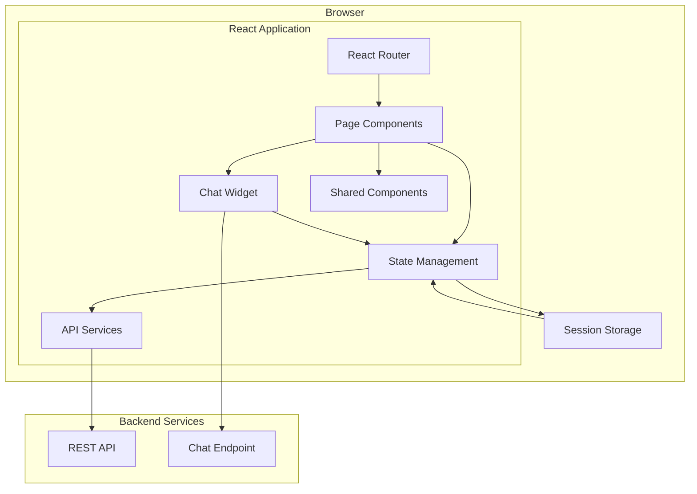

# Design Document: FoodBridge Frontend

## Overview

The FoodBridge Frontend is a React-based single-page application (SPA) that provides the user interface for the FoodBridge AI platform. The application follows a component-based architecture with clear separation between presentation, business logic, and data access layers.

The frontend architecture consists of:

1. **Presentation Layer**: React components organized by feature and shared components
2. **State Management Layer**: Centralized state using React Context API or Redux
3. **Service Layer**: API client services for backend communication
4. **Routing Layer**: React Router for navigation and route protection
5. **Utility Layer**: Helper functions, validators, and formatters

The application communicates with two backend endpoints:
- REST API for data operations (authentication, listings, reservations, etc.)
- Chat API for AI assistant conversations

All authenticated requests include JWT tokens in the Authorization header. The application maintains session state in browser storage and implements automatic token refresh and session expiration handling.

## Architecture

### High-Level Architecture Diagram



### Technology Stack

**Core Framework:**
- React 18+ with functional components and hooks
- TypeScript for type safety
- React Router v6 for routing

**State Management:**
- React Context API for global state (authentication, user profile)
- Local component state for UI-specific state
- Optional: Redux Toolkit for complex state scenarios

**HTTP Client:**
- Axios for API requests
- Interceptors for authentication and error handling

**UI Framework:**
- Tailwind CSS for styling
- Headless UI or Radix UI for accessible components
- React Icons for iconography

**Form Management:**
- React Hook Form for form state and validation
- Zod for schema validation

**Build Tools:**
- Vite for fast development and optimized builds
- ESLint and Prettier for code quality


## Components and Interfaces

### Component Architecture

The application follows a feature-based component organization with shared components:

```
src/
├── components/
│   ├── auth/
│   │   ├── LoginForm.tsx
│   │   ├── RegisterForm.tsx
│   │   └── ProtectedRoute.tsx
│   ├── dashboard/
│   │   ├── StudentDashboard.tsx
│   │   ├── ProviderDashboard.tsx
│   │   ├── RecentListings.tsx
│   │   ├── UpcomingReservations.tsx
│   │   └── QuickActions.tsx
│   ├── listings/
│   │   ├── ListingsPage.tsx
│   │   ├── ListingCard.tsx
│   │   ├── ListingDetail.tsx
│   │   ├── ListingFilters.tsx
│   │   ├── CreateListingForm.tsx
│   │   └── ReservationForm.tsx
│   ├── pantry/
│   │   ├── PantryPage.tsx
│   │   ├── PantryInventory.tsx
│   │   ├── PantryCart.tsx
│   │   ├── AppointmentSlots.tsx
│   │   └── AppointmentList.tsx
│   ├── events/
│   │   ├── EventsPage.tsx
│   │   ├── EventFoodList.tsx
│   │   ├── VolunteerOpportunities.tsx
│   │   └── VolunteerCard.tsx
│   ├── notifications/
│   │   ├── NotificationsPage.tsx
│   │   ├── NotificationList.tsx
│   │   ├── NotificationItem.tsx
│   │   └── NotificationBadge.tsx
│   ├── profile/
│   │   ├── ProfilePage.tsx
│   │   ├── ProfileForm.tsx
│   │   ├── PreferencesForm.tsx
│   │   └── NotificationSettings.tsx
│   ├── chat/
│   │   ├── ChatWidget.tsx
│   │   ├── ChatMessage.tsx
│   │   ├── ChatInput.tsx
│   │   └── ToolExecutionFeedback.tsx
│   └── shared/
│       ├── Layout.tsx
│       ├── Navigation.tsx
│       ├── Button.tsx
│       ├── Input.tsx
│       ├── Select.tsx
│       ├── Modal.tsx
│       ├── LoadingSpinner.tsx
│       ├── ErrorMessage.tsx
│       ├── SuccessNotification.tsx
│       └── Pagination.tsx
```

### Key Component Specifications

**1. Authentication Components**

**LoginForm Component:**
- Props: `onSuccess: () => void`
- State: `{ email: string, password: string, isLoading: boolean, error: string | null }`
- Validates email format and password presence
- Calls `authService.login()` on submission
- Stores JWT token on success
- Displays error messages on failure

**RegisterForm Component:**
- Props: `onSuccess: () => void`
- State: `{ email: string, password: string, confirmPassword: string, role: 'student' | 'provider', isLoading: boolean, errors: Record<string, string> }`
- Validates email, password strength, password match, and role selection
- Calls `authService.register()` on submission
- Redirects to login on success

**ProtectedRoute Component:**
- Props: `{ children: ReactNode, requiredRole?: 'student' | 'provider' | 'admin' }`
- Checks authentication state from context
- Redirects to login if not authenticated
- Checks role authorization if requiredRole specified
- Renders children if authorized

**2. Dashboard Components**

**StudentDashboard Component:**
- Fetches recent listings matching user preferences
- Fetches upcoming reservations and appointments
- Fetches recent notifications
- Displays quick action buttons (Browse Food, Book Pantry, View Notifications)
- Refreshes data on mount

**ProviderDashboard Component:**
- Fetches provider's active listings
- Displays reservation statistics (total reservations, items reserved)
- Shows quick action button to create new listing
- Displays recent reservations across all listings

**3. Listings Components**

**ListingsPage Component:**
- State: `{ listings: Listing[], filters: FilterState, page: number, hasMore: boolean, isLoading: boolean }`
- Fetches listings with pagination
- Implements infinite scroll or pagination controls
- Manages filter state and applies filters to API requests
- Displays ListingCard components in a grid layout

**ListingCard Component:**
- Props: `{ listing: Listing, onReserve?: (listingId: string) => void, onEdit?: (listingId: string) => void }`
- Displays listing summary (name, quantity, location, pickup window)
- Shows dietary tags
- Displays reserve button for students
- Displays edit/delete buttons for providers (own listings only)

**ListingDetail Component:**
- Props: `{ listingId: string }`
- Fetches full listing details
- Displays complete information including description
- Shows reservation form for students
- Shows reservation list for providers

**ListingFilters Component:**
- Props: `{ filters: FilterState, onChange: (filters: FilterState) => void }`
- Provides filter controls for dietary preferences, location, food type
- Displays active filters as removable tags
- Emits filter changes to parent component

**CreateListingForm Component:**
- State: `{ formData: ListingFormData, errors: Record<string, string>, isLoading: boolean }`
- Validates all required fields
- Validates pickup window is in the future
- Calls `listingsService.createListing()` on submission
- Displays success message and redirects on success

**ReservationForm Component:**
- Props: `{ listing: Listing, onSuccess: () => void, onCancel: () => void }`
- State: `{ quantity: number, isLoading: boolean, error: string | null }`
- Validates quantity is between 1 and available_quantity
- Calls `reservationsService.createReservation()` on submission
- Updates parent component on success

**4. Pantry Components**

**PantryPage Component:**
- State: `{ inventory: PantryItem[], cart: CartItem[], appointments: Appointment[], slots: TimeSlot[], isLoading: boolean }`
- Fetches pantry inventory and available slots
- Manages cart state
- Displays inventory, cart, and appointment booking interface

**PantryInventory Component:**
- Props: `{ items: PantryItem[], onAddToCart: (item: PantryItem) => void }`
- Displays pantry items in a grid or list
- Shows item availability status
- Provides add to cart button for available items

**PantryCart Component:**
- Props: `{ items: CartItem[], onRemove: (itemId: string) => void, onUpdateQuantity: (itemId: string, quantity: number) => void }`
- Displays selected items with quantities
- Allows quantity adjustment and item removal
- Shows total item count

**AppointmentSlots Component:**
- Props: `{ slots: TimeSlot[], onSelect: (slotId: string) => void, selectedSlot: string | null }`
- Displays available time slots
- Highlights selected slot
- Disables booked slots

**5. Chat Components**

**ChatWidget Component:**
- State: `{ isOpen: boolean, messages: Message[], input: string, isLoading: boolean, sessionId: string }`
- Toggles between collapsed and expanded states
- Maintains conversation history in session storage
- Sends messages to chat endpoint
- Displays AI responses with markdown formatting
- Shows tool execution feedback

**ChatMessage Component:**
- Props: `{ message: Message, isUser: boolean }`
- Renders message content with markdown support
- Displays timestamp
- Shows user/assistant avatar
- Applies different styling for user vs assistant messages

**ChatInput Component:**
- Props: `{ onSend: (message: string) => void, disabled: boolean }`
- Provides text input with send button
- Handles Enter key to send
- Disables input during loading

**ToolExecutionFeedback Component:**
- Props: `{ toolName: string, status: 'executing' | 'success' | 'error', result?: any }`
- Displays tool execution status
- Shows loading indicator during execution
- Displays formatted results on success
- Shows error message on failure

**6. Shared Components**

**Layout Component:**
- Props: `{ children: ReactNode }`
- Provides consistent page structure
- Includes Navigation component
- Includes ChatWidget component
- Manages responsive layout

**Navigation Component:**
- Displays navigation menu with links to all pages
- Shows notification badge with unread count
- Includes logout button
- Adapts to mobile with hamburger menu

**Button Component:**
- Props: `{ variant: 'primary' | 'secondary' | 'danger', size: 'sm' | 'md' | 'lg', isLoading?: boolean, disabled?: boolean, onClick: () => void, children: ReactNode }`
- Provides consistent button styling
- Shows loading spinner when isLoading is true
- Handles disabled state

**Modal Component:**
- Props: `{ isOpen: boolean, onClose: () => void, title: string, children: ReactNode }`
- Provides modal dialog with backdrop
- Handles escape key to close
- Manages focus trap
- Accessible with ARIA attributes

**LoadingSpinner Component:**
- Props: `{ size?: 'sm' | 'md' | 'lg' }`
- Displays animated loading indicator
- Accessible with ARIA live region

**ErrorMessage Component:**
- Props: `{ message: string, onDismiss?: () => void }`
- Displays error message with appropriate styling
- Includes dismiss button if onDismiss provided
- Accessible with ARIA role="alert"

**SuccessNotification Component:**
- Props: `{ message: string, duration?: number }`
- Displays success message
- Auto-dismisses after duration (default 3 seconds)
- Accessible with ARIA live region

**Pagination Component:**
- Props: `{ currentPage: number, totalPages: number, onPageChange: (page: number) => void }`
- Displays page numbers and navigation buttons
- Highlights current page
- Disables previous/next buttons at boundaries


### Service Layer

The service layer provides a clean abstraction for API communication:

**API Client Configuration:**

```typescript
// src/services/apiClient.ts
import axios from 'axios';

const apiClient = axios.create({
  baseURL: process.env.REACT_APP_API_URL || 'http://localhost:3000/api',
  timeout: 30000,
  headers: {
    'Content-Type': 'application/json',
  },
});

// Request interceptor to add JWT token
apiClient.interceptors.request.use(
  (config) => {
    const token = sessionStorage.getItem('jwt_token');
    if (token) {
      config.headers.Authorization = `Bearer ${token}`;
    }
    return config;
  },
  (error) => Promise.reject(error)
);

// Response interceptor for error handling
apiClient.interceptors.response.use(
  (response) => response,
  (error) => {
    if (error.response?.status === 401) {
      sessionStorage.removeItem('jwt_token');
      window.location.href = '/login';
    }
    return Promise.reject(error);
  }
);
```

**Service Interfaces:**

**AuthService:**
```typescript
interface AuthService {
  login(email: string, password: string): Promise<{ token: string; user: User }>;
  register(data: RegisterData): Promise<void>;
  logout(): void;
  getCurrentUser(): Promise<User>;
}
```

**ListingsService:**
```typescript
interface ListingsService {
  getListings(params: ListingQueryParams): Promise<PaginatedResponse<Listing>>;
  getListingById(id: string): Promise<Listing>;
  createListing(data: CreateListingData): Promise<Listing>;
  updateListing(id: string, data: UpdateListingData): Promise<Listing>;
  deleteListing(id: string): Promise<void>;
  getProviderListings(providerId: string): Promise<Listing[]>;
}
```

**ReservationsService:**
```typescript
interface ReservationsService {
  createReservation(listingId: string, quantity: number): Promise<Reservation>;
  getStudentReservations(studentId: string): Promise<Reservation[]>;
  getListingReservations(listingId: string): Promise<Reservation[]>;
  cancelReservation(reservationId: string): Promise<void>;
}
```

**PantryService:**
```typescript
interface PantryService {
  getInventory(): Promise<PantryItem[]>;
  getAvailableSlots(): Promise<TimeSlot[]>;
  bookAppointment(slotId: string): Promise<Appointment>;
  getStudentAppointments(studentId: string): Promise<Appointment[]>;
  cancelAppointment(appointmentId: string): Promise<void>;
  createOrder(items: CartItem[]): Promise<Order>;
  generateSmartCart(): Promise<CartItem[]>;
}
```

**NotificationsService:**
```typescript
interface NotificationsService {
  getNotifications(userId: string): Promise<Notification[]>;
  markAsRead(notificationId: string): Promise<void>;
  deleteNotification(notificationId: string): Promise<void>;
  getUnreadCount(userId: string): Promise<number>;
}
```

**ProfileService:**
```typescript
interface ProfileService {
  getProfile(userId: string): Promise<UserProfile>;
  updateProfile(userId: string, data: UpdateProfileData): Promise<UserProfile>;
  updatePreferences(userId: string, preferences: Preferences): Promise<void>;
}
```

**EventsService:**
```typescript
interface EventsService {
  getEventFood(): Promise<Listing[]>;
  getVolunteerOpportunities(): Promise<VolunteerOpportunity[]>;
  signUpForVolunteer(opportunityId: string): Promise<void>;
  getStudentVolunteerHistory(studentId: string): Promise<VolunteerParticipation[]>;
  cancelVolunteerSignup(participationId: string): Promise<void>;
}
```

**ChatService:**
```typescript
interface ChatService {
  sendMessage(sessionId: string, message: string): Promise<ChatResponse>;
  getSessionHistory(sessionId: string): Promise<Message[]>;
  createSession(): Promise<string>;
}
```

### Routing Configuration

**Route Structure:**

```typescript
// src/routes/index.tsx
const routes = [
  {
    path: '/login',
    element: <LoginPage />,
    public: true,
  },
  {
    path: '/register',
    element: <RegisterPage />,
    public: true,
  },
  {
    path: '/',
    element: <ProtectedRoute><Layout /></ProtectedRoute>,
    children: [
      {
        index: true,
        element: <DashboardPage />,
      },
      {
        path: 'listings',
        element: <ListingsPage />,
      },
      {
        path: 'listings/:id',
        element: <ListingDetailPage />,
      },
      {
        path: 'pantry',
        element: <PantryPage />,
      },
      {
        path: 'events',
        element: <EventsPage />,
      },
      {
        path: 'notifications',
        element: <NotificationsPage />,
      },
      {
        path: 'profile',
        element: <ProfilePage />,
      },
    ],
  },
  {
    path: '*',
    element: <NotFoundPage />,
  },
];
```

### State Management

**Authentication Context:**

```typescript
interface AuthContextType {
  user: User | null;
  token: string | null;
  isAuthenticated: boolean;
  login: (email: string, password: string) => Promise<void>;
  logout: () => void;
  isLoading: boolean;
}
```

**Notification Context:**

```typescript
interface NotificationContextType {
  unreadCount: number;
  refreshUnreadCount: () => Promise<void>;
  showSuccess: (message: string) => void;
  showError: (message: string) => void;
}
```

**Chat Context:**

```typescript
interface ChatContextType {
  sessionId: string;
  messages: Message[];
  isOpen: boolean;
  toggleChat: () => void;
  sendMessage: (message: string) => Promise<void>;
  isLoading: boolean;
}
```


## Data Models

### TypeScript Interfaces

**User and Authentication:**

```typescript
interface User {
  user_id: string;
  email: string;
  role: 'student' | 'provider' | 'admin';
  created_at: string;
}

interface UserProfile {
  profile_id: string;
  user_id: string;
  dietary_preferences: string[];
  allergies: string[];
  preferred_food_types: string[];
  notification_preferences: NotificationPreferences;
}

interface NotificationPreferences {
  email_enabled: boolean;
  push_enabled: boolean;
  new_listings: boolean;
  reservation_confirmations: boolean;
  appointment_reminders: boolean;
}

interface RegisterData {
  email: string;
  password: string;
  role: 'student' | 'provider';
}
```

**Food Listings:**

```typescript
interface Listing {
  listing_id: string;
  provider_id: string;
  food_name: string;
  description: string;
  quantity: number;
  available_quantity: number;
  location: string;
  pickup_window_start: string;
  pickup_window_end: string;
  food_type: string;
  dietary_tags: string[];
  listing_type: 'donation' | 'event' | 'dining_deal';
  status: 'active' | 'expired' | 'completed' | 'unavailable';
  created_at: string;
  updated_at: string;
}

interface CreateListingData {
  food_name: string;
  description: string;
  quantity: number;
  location: string;
  pickup_window_start: string;
  pickup_window_end: string;
  food_type: string;
  dietary_tags: string[];
  listing_type: 'donation' | 'event' | 'dining_deal';
}

interface UpdateListingData {
  food_name?: string;
  description?: string;
  quantity?: number;
  location?: string;
  pickup_window_start?: string;
  pickup_window_end?: string;
  food_type?: string;
  dietary_tags?: string[];
  status?: 'active' | 'expired' | 'completed' | 'unavailable';
}

interface ListingQueryParams {
  page?: number;
  limit?: number;
  dietary?: string[];
  location?: string;
  food_type?: string;
  listing_type?: 'donation' | 'event' | 'dining_deal';
}

interface PaginatedResponse<T> {
  data: T[];
  pagination: {
    total_count: number;
    page: number;
    limit: number;
    total_pages: number;
  };
}
```

**Reservations:**

```typescript
interface Reservation {
  reservation_id: string;
  listing_id: string;
  student_id: string;
  quantity: number;
  status: 'active' | 'cancelled' | 'completed';
  created_at: string;
  listing?: Listing; // Populated in some responses
}
```

**Pantry:**

```typescript
interface PantryItem {
  item_id: string;
  item_name: string;
  category: string;
  quantity: number;
  in_stock: boolean;
  unit: string;
}

interface TimeSlot {
  slot_id: string;
  slot_time: string;
  is_booked: boolean;
}

interface Appointment {
  appointment_id: string;
  student_id: string;
  slot_id: string;
  status: 'scheduled' | 'completed' | 'cancelled';
  created_at: string;
  slot?: TimeSlot; // Populated in some responses
}

interface CartItem {
  item_id: string;
  item_name: string;
  quantity: number;
}

interface Order {
  order_id: string;
  student_id: string;
  appointment_id: string | null;
  items: CartItem[];
  status: 'pending' | 'completed' | 'cancelled';
  created_at: string;
}
```

**Notifications:**

```typescript
interface Notification {
  notification_id: string;
  user_id: string;
  type: string;
  message: string;
  is_read: boolean;
  created_at: string;
}
```

**Events and Volunteers:**

```typescript
interface VolunteerOpportunity {
  opportunity_id: string;
  title: string;
  description: string;
  max_volunteers: number;
  current_volunteers: number;
  event_date: string;
  status: 'open' | 'closed' | 'completed';
  created_at: string;
}

interface VolunteerParticipation {
  participation_id: string;
  opportunity_id: string;
  student_id: string;
  status: 'signed_up' | 'completed' | 'cancelled';
  created_at: string;
  opportunity?: VolunteerOpportunity; // Populated in some responses
}
```

**Chat:**

```typescript
interface Message {
  id: string;
  role: 'user' | 'assistant';
  content: string;
  timestamp: string;
  tool_calls?: ToolCall[];
}

interface ToolCall {
  tool_name: string;
  status: 'executing' | 'success' | 'error';
  result?: any;
  error?: string;
}

interface ChatResponse {
  message: Message;
  session_id: string;
}
```

**Form State:**

```typescript
interface FilterState {
  dietary: string[];
  location: string;
  food_type: string;
}

interface ListingFormData {
  food_name: string;
  description: string;
  quantity: number;
  location: string;
  pickup_window_start: string;
  pickup_window_end: string;
  food_type: string;
  dietary_tags: string[];
  listing_type: 'donation' | 'event' | 'dining_deal';
}

interface ProfileFormData {
  dietary_preferences: string[];
  allergies: string[];
  preferred_food_types: string[];
  notification_preferences: NotificationPreferences;
}
```

### Local Storage Schema

**Session Storage:**
- `jwt_token`: JWT authentication token (string)
- `user`: Current user object (JSON string)
- `chat_session_id`: Current chat session ID (string)
- `chat_messages`: Chat conversation history (JSON string)

**Local Storage:**
- `filter_preferences`: Last used filter settings (JSON string)
- `theme_preference`: UI theme preference (string)


## Correctness Properties

A property is a characteristic or behavior that should hold true across all valid executions of a system—essentially, a formal statement about what the system should do. Properties serve as the bridge between human-readable specifications and machine-verifiable correctness guarantees.

### Authentication and Session Management Properties

**Property 1: Valid login credentials store JWT token**
*For any* valid user credentials, submitting them through the login form should result in a JWT token being stored in session storage and the user being authenticated.
**Validates: Requirements 1.2**

**Property 2: Invalid login credentials do not store tokens**
*For any* invalid credentials, submitting them through the login form should result in no JWT token being stored and an error message being displayed.
**Validates: Requirements 1.3**

**Property 3: Valid registration redirects to login**
*For any* valid registration data, submitting the registration form should result in the data being sent to the backend API and a redirect to the login page.
**Validates: Requirements 1.5**

**Property 4: Logout clears authentication state (round-trip)**
*For any* authenticated user, logging out should clear the JWT token from session storage and redirect to the login page, such that the user is no longer authenticated.
**Validates: Requirements 1.6**

**Property 5: Session persistence across page refresh**
*For any* authenticated user with a valid JWT token in session storage, refreshing the page should maintain the authenticated state without requiring re-login.
**Validates: Requirements 1.7**

### Route Protection Properties

**Property 6: Authenticated users can access protected routes**
*For any* authenticated user and any protected route, navigating to that route should render the requested page without redirection.
**Validates: Requirements 2.1**

**Property 7: Unauthenticated users are redirected from protected routes**
*For any* unauthenticated user attempting to access a protected route, the application should redirect to the login page.
**Validates: Requirements 2.2**

**Property 8: SPA navigation without full page reload**
*For any* navigation link click, the application should transition to the target page without triggering a full page reload (browser navigation event should not fire).
**Validates: Requirements 2.3**

**Property 9: Navigation menu present on all authenticated pages**
*For any* authenticated page, the navigation menu component should be rendered and visible.
**Validates: Requirements 2.4**

### Dashboard Properties

**Property 10: Student dashboard displays personalized listings**
*For any* student with dietary preferences, accessing the dashboard should display food listings that match those preferences.
**Validates: Requirements 3.1**

**Property 11: Dashboard displays user's reservations and appointments**
*For any* student with active reservations or pantry appointments, accessing the dashboard should display those reservations and appointments.
**Validates: Requirements 3.2**

**Property 12: Dashboard displays recent notifications**
*For any* user with recent notifications, accessing the dashboard should display those notifications.
**Validates: Requirements 3.3**

**Property 13: Provider dashboard displays listings and statistics**
*For any* provider with active food listings, accessing the dashboard should display those listings along with reservation statistics.
**Validates: Requirements 3.5**

**Property 14: Dashboard refreshes data on navigation**
*For any* user, navigating away from the dashboard and then returning should result in fresh data being fetched and displayed.
**Validates: Requirements 3.6**

### Listings and Search Properties

**Property 15: Listings page fetches and displays active listings**
*For any* user accessing the listings page, the page should fetch active food listings from the backend API and display them.
**Validates: Requirements 4.1**

**Property 16: Filters are applied correctly to search results**
*For any* combination of filters (dietary, location, food type), applying those filters should result in only listings matching all filter criteria being displayed.
**Validates: Requirements 4.2, 4.3, 4.4, 20.2, 20.6**

**Property 17: Infinite scroll loads additional pages**
*For any* listings page with more results available, scrolling to the bottom should trigger fetching and displaying the next page of results.
**Validates: Requirements 4.5, 19.2**

**Property 18: Listing detail displays all required information**
*For any* listing, clicking on it should display a detail view containing description, quantity, available_quantity, location, pickup_window_start, and pickup_window_end.
**Validates: Requirements 4.6**

**Property 19: Listings are ordered by pickup time**
*For any* set of listings displayed, they should be ordered by pickup_window_start in ascending order.
**Validates: Requirements 4.7**

**Property 20: Filter state persists across navigation**
*For any* applied filters, navigating away from the listings page and returning should preserve the filter state.
**Validates: Requirements 20.7**

**Property 21: Active filters displayed as removable tags**
*For any* applied filter, the filter should be displayed as a tag that can be clicked to remove the filter.
**Validates: Requirements 20.3, 20.4**

### Reservation Properties

**Property 22: Valid reservation displays confirmation**
*For any* valid reservation request (quantity <= available_quantity), submitting the reservation should result in a confirmation message being displayed.
**Validates: Requirements 5.2**

**Property 23: Successful reservation updates available quantity immediately**
*For any* successful reservation, the displayed available_quantity for that listing should decrease by the reserved quantity immediately without requiring a page refresh.
**Validates: Requirements 5.4**

**Property 24: User's reservations are displayed**
*For any* student with active reservations, viewing their reservations should display all active reservations fetched from the backend API.
**Validates: Requirements 5.5**

**Property 25: Canceling reservation removes it from display**
*For any* active reservation, canceling it should result in the reservation being removed from the display and the cancellation being sent to the backend API.
**Validates: Requirements 5.6**

### Pantry Properties

**Property 26: Pantry page displays inventory and slots**
*For any* user accessing the pantry page, the page should fetch and display both pantry inventory items and available appointment slots.
**Validates: Requirements 6.1, 6.2**

**Property 27: Selected items are added to cart**
*For any* pantry item, selecting it should result in the item being added to the cart interface.
**Validates: Requirements 6.3**

**Property 28: Appointment booking displays confirmation**
*For any* successful appointment booking, the application should display a confirmation message and update the appointments list.
**Validates: Requirements 6.6**

**Property 29: User's pantry appointments are displayed**
*For any* student with upcoming pantry appointments, viewing their appointments should display all upcoming appointments fetched from the backend API.
**Validates: Requirements 6.7**

**Property 30: Canceling appointment updates display**
*For any* pantry appointment, canceling it should result in the cancellation being sent to the backend API and the appointment being removed from or updated in the display.
**Validates: Requirements 6.8**

### Events and Volunteer Properties

**Property 31: Events page displays event food and volunteer opportunities**
*For any* user accessing the events page, the page should fetch and display both event food listings and volunteer opportunities.
**Validates: Requirements 7.1, 7.2**

**Property 32: Event food detail displays information and reservation options**
*For any* event food listing, clicking on it should display detailed information and reservation options.
**Validates: Requirements 7.3**

**Property 33: Volunteer opportunity detail displays information and sign-up button**
*For any* volunteer opportunity, clicking on it should display details and a sign-up button.
**Validates: Requirements 7.4**

**Property 34: Volunteer signup displays confirmation**
*For any* volunteer opportunity signup, the application should send the signup to the backend API and display a confirmation message.
**Validates: Requirements 7.5**

**Property 35: Full volunteer opportunities disable sign-up button**
*For any* volunteer opportunity where current_volunteers >= max_volunteers, the sign-up button should be disabled and the opportunity should be displayed as full.
**Validates: Requirements 7.6**

### Notifications Properties

**Property 36: Notifications are ordered by timestamp descending**
*For any* user's notifications, they should be displayed ordered by created_at timestamp in descending order (most recent first).
**Validates: Requirements 8.1**

**Property 37: Viewing notification marks it as read**
*For any* unread notification, viewing it should result in a request to the backend API to mark it as read.
**Validates: Requirements 8.2**

**Property 38: Deleting notification removes it from display**
*For any* notification, deleting it should result in the deletion request being sent to the backend API and the notification being removed from the display.
**Validates: Requirements 8.3**

**Property 39: Notification badge displays unread count**
*For any* user with unread notifications, the notification badge in the navigation menu should display the count of unread notifications.
**Validates: Requirements 8.4**

**Property 40: New notifications update badge count**
*For any* user, when new notifications are created, the notification badge count should update to reflect the new unread count.
**Validates: Requirements 8.5**

**Property 41: Notifications are grouped by type**
*For any* set of notifications, they should be grouped by notification type for easier browsing.
**Validates: Requirements 8.6**

### Profile Management Properties

**Property 42: Profile page displays current user data**
*For any* user accessing the profile page, the page should fetch and display the current user's profile data from the backend API.
**Validates: Requirements 9.1**

**Property 43: Profile updates display success messages**
*For any* valid profile update (dietary preferences, allergies, preferred food types, or notification preferences), submitting the update should result in the data being sent to the backend API and a success message being displayed.
**Validates: Requirements 9.2, 9.3, 9.4, 9.5**

**Property 44: Invalid profile updates display field-specific errors**
*For any* profile update with validation errors, the application should display specific error messages for each invalid field.
**Validates: Requirements 9.6**

### Chat Widget Properties

**Property 45: Chat widget is accessible on all authenticated pages**
*For any* authenticated page, the chat widget should be visible and accessible.
**Validates: Requirements 10.1**

**Property 46: Chat widget expands on click**
*For any* chat widget in collapsed state, clicking it should expand the widget to display the conversation interface.
**Validates: Requirements 10.2**

**Property 47: Messages are sent and responses displayed**
*For any* message sent through the chat widget, the message should be sent to the chat endpoint and the response should be displayed in the conversation.
**Validates: Requirements 10.3**

**Property 48: Chat displays loading indicator during processing**
*For any* message being processed by the AI assistant, the chat widget should display a loading indicator.
**Validates: Requirements 10.4**

**Property 49: Tool execution displays feedback**
*For any* tool execution by the AI assistant, the chat widget should display feedback about the action being performed and the result in a formatted manner.
**Validates: Requirements 10.5, 10.6**

**Property 50: Conversation history is maintained within session**
*For any* chat session, sending multiple messages should result in all messages being maintained in the conversation history.
**Validates: Requirements 10.7**

**Property 51: Conversation history persists across widget toggles**
*For any* chat session, closing and reopening the chat widget should preserve the conversation history.
**Validates: Requirements 10.8**

**Property 52: New session clears conversation history**
*For any* user starting a new chat session, the previous conversation history should be cleared.
**Validates: Requirements 10.9**

**Property 53: Chat supports markdown formatting**
*For any* AI response containing markdown syntax, the chat widget should render the markdown as formatted content.
**Validates: Requirements 10.10**

### Provider Listing Management Properties

**Property 54: Valid listing creation displays success**
*For any* valid listing form submission by a provider, the listing data should be sent to the backend API and a success message should be displayed.
**Validates: Requirements 11.3**

**Property 55: Provider's listings are displayed**
*For any* provider, viewing their listings should fetch and display all listings created by that provider.
**Validates: Requirements 11.4**

**Property 56: Edit form is pre-filled with existing data**
*For any* listing being edited, clicking edit should display a form pre-filled with the listing's current data.
**Validates: Requirements 11.5**

**Property 57: Listing updates refresh display**
*For any* listing update by a provider, the update should be sent to the backend API and the display should refresh to show the updated data.
**Validates: Requirements 11.6**

**Property 58: Listing deletion removes from display**
*For any* listing deleted by a provider, the deletion request should be sent to the backend API and the listing should be removed from the display.
**Validates: Requirements 11.7**

**Property 59: Provider views reservations for their listings**
*For any* listing with reservations, when a provider views that listing, all reservations for that listing should be displayed.
**Validates: Requirements 11.8**

### Form Validation Properties

**Property 60: Real-time validation on input**
*For any* required form field, entering data should trigger validation in real-time.
**Validates: Requirements 12.1**

**Property 61: Validation errors are displayed for invalid inputs**
*For any* invalid form input (empty required field, invalid email format, short password, invalid quantity, invalid time range), the form should display an appropriate error message for that field.
**Validates: Requirements 12.2, 12.3, 12.4, 12.5, 12.6**

**Property 62: Submit button enabled only when form is valid**
*For any* form, the submit button should be enabled if and only if all form fields pass validation.
**Validates: Requirements 12.7**

### Error Handling Properties

**Property 63: API validation errors are displayed**
*For any* API request that fails with a 400 error, the application should display validation error messages from the API response.
**Validates: Requirements 13.4**

**Property 64: Success operations display success notifications**
*For any* successful operation, the application should display a success notification.
**Validates: Requirements 13.6**

**Property 65: Success notifications auto-dismiss after 3 seconds**
*For any* success notification, the notification should automatically dismiss after 3 seconds.
**Validates: Requirements 13.7**

**Property 66: Error notifications persist until dismissed**
*For any* error notification, the notification should remain visible until the user explicitly dismisses it.
**Validates: Requirements 13.8**

### Loading State Properties

**Property 67: API requests display loading indicators**
*For any* API request in progress, the application should display a loading indicator.
**Validates: Requirements 14.1**

**Property 68: Page loading displays skeleton loaders**
*For any* page loading data, the application should display skeleton loaders or spinners while data is being fetched.
**Validates: Requirements 14.2**

**Property 69: Form submission disables submit button**
*For any* form being submitted, the submit button should be disabled and display a loading state.
**Validates: Requirements 14.3**

**Property 70: Image loading displays placeholders**
*For any* image being loaded, the application should display a placeholder image until the actual image loads.
**Validates: Requirements 14.4**

### Responsive Design Properties

**Property 71: Layout adapts to viewport size**
*For any* viewport size (mobile, tablet, desktop), the application layout should adapt appropriately to that screen size.
**Validates: Requirements 15.1, 15.2, 15.3**

**Property 72: Mobile navigation is mobile-friendly**
*For any* mobile viewport, the application should display a mobile-friendly navigation menu.
**Validates: Requirements 15.4**

**Property 73: Chat widget adapts to screen size**
*For any* viewport size, the chat widget should adapt its size and position based on the screen size.
**Validates: Requirements 15.5**

**Property 74: Interactive elements are touch-friendly on mobile**
*For any* interactive element on a mobile viewport, the element should meet minimum touch target size requirements.
**Validates: Requirements 15.6**

### API Communication Properties

**Property 75: Authenticated requests include JWT token**
*For any* authenticated API request, the HTTP client should include the JWT token in the Authorization header.
**Validates: Requirements 16.1**

**Property 76: Requests without tokens do not include auth headers**
*For any* API request when no JWT token is stored, the HTTP client should not include an Authorization header.
**Validates: Requirements 16.2**

**Property 77: Requests include appropriate Content-Type headers**
*For any* API request, the HTTP client should set the appropriate Content-Type header.
**Validates: Requirements 16.3**

**Property 78: JSON responses are parsed correctly**
*For any* API response with JSON content, the HTTP client should parse the response as JSON.
**Validates: Requirements 16.4**

**Property 79: API errors are thrown with response details**
*For any* API response containing an error, the HTTP client should throw an error that includes the response details.
**Validates: Requirements 16.5**

**Property 80: HTTP client supports all required methods**
*For any* HTTP method (GET, POST, PUT, PATCH, DELETE), the HTTP client should support making requests with that method.
**Validates: Requirements 16.6**

**Property 81: Requests timeout after 30 seconds**
*For any* API request that takes longer than 30 seconds, the HTTP client should timeout and throw an error.
**Validates: Requirements 16.7**

### State Management Properties

**Property 82: Authentication state is stored**
*For any* authenticated user, the state management system should store the user's authentication state.
**Validates: Requirements 17.1**

**Property 83: Profile data is stored in state**
*For any* user profile loaded, the state management system should store the profile data.
**Validates: Requirements 17.2**

**Property 84: Page data is stored in state**
*For any* page with data, the state management system should store the current page's data.
**Validates: Requirements 17.3**

**Property 85: State updates trigger component re-renders**
*For any* state change, affected components should re-render to reflect the new state.
**Validates: Requirements 17.5**

**Property 86: Authentication state persists to session storage (round-trip)**
*For any* authenticated user, the authentication state should be persisted to session storage, and when the application loads, the state should be restored from session storage.
**Validates: Requirements 17.6, 17.7**

### Accessibility Properties

**Property 87: All images have alt text**
*For any* image element in the application, the image should have an alt attribute with descriptive text.
**Validates: Requirements 18.1**

**Property 88: Interactive elements are keyboard accessible**
*For any* interactive element, the element should be accessible and operable via keyboard navigation.
**Validates: Requirements 18.2**

**Property 89: Heading hierarchy is maintained**
*For any* page, the heading elements should follow proper hierarchy (h1, h2, h3, etc.) without skipping levels.
**Validates: Requirements 18.3**

**Property 90: Icon buttons have ARIA labels**
*For any* icon button without visible text, the button should have an aria-label attribute.
**Validates: Requirements 18.4**

**Property 91: Text elements have sufficient color contrast**
*For any* text element, the color contrast ratio between text and background should meet WCAG AA standards (4.5:1 for normal text, 3:1 for large text).
**Validates: Requirements 18.5**

**Property 92: Interactive elements have visible focus indicators**
*For any* interactive element, when focused via keyboard navigation, the element should display a visible focus indicator.
**Validates: Requirements 18.6**

**Property 93: Chat widget is keyboard accessible**
*For any* chat widget interaction, the widget should be fully accessible and operable via keyboard navigation.
**Validates: Requirements 18.7**

### Pagination Properties

**Property 94: Large lists implement pagination**
*For any* list with more than 20 items, the application should implement pagination or infinite scroll.
**Validates: Requirements 19.1**

**Property 95: Navigation scrolls to top of content**
*For any* page navigation, the application should scroll to the top of the content area.
**Validates: Requirements 19.3**

**Property 96: Pagination displays page information**
*For any* paginated list, the application should display the current page number and total pages.
**Validates: Requirements 19.4**

**Property 97: Loading additional pages displays loading indicator**
*For any* pagination action that loads additional pages, the application should display a loading indicator at the bottom of the list.
**Validates: Requirements 19.5**


## Error Handling

### Error Categories

**1. Network Errors**
- Connection failures
- Timeout errors
- DNS resolution failures

**Handling Strategy:**
- Display user-friendly message: "Unable to connect. Please check your internet connection."
- Provide retry button
- Log error details for debugging

**2. Authentication Errors (401)**
- Expired JWT token
- Invalid token
- Missing token

**Handling Strategy:**
- Clear stored JWT token from session storage
- Redirect to login page
- Display message: "Your session has expired. Please log in again."
- Preserve intended destination for post-login redirect

**3. Authorization Errors (403)**
- Insufficient permissions
- Role-based access denial

**Handling Strategy:**
- Display message: "You don't have permission to perform this action."
- Do not redirect (user remains on current page)
- Log error for security monitoring

**4. Validation Errors (400)**
- Invalid form data
- Business rule violations
- Constraint violations

**Handling Strategy:**
- Parse error response from API
- Display field-specific error messages
- Highlight invalid fields
- Keep user on current page with form data intact

**5. Not Found Errors (404)**
- Resource does not exist
- Invalid route

**Handling Strategy:**
- Display "Resource not found" message
- Provide navigation back to relevant page
- For invalid routes, show 404 page with navigation options

**6. Server Errors (500)**
- Internal server errors
- Database errors
- Unexpected exceptions

**Handling Strategy:**
- Display generic message: "Something went wrong. Please try again later."
- Provide retry button
- Log full error details for debugging
- Do not expose internal error details to user

### Error Boundary Implementation

**React Error Boundaries:**
- Wrap major sections of the application in error boundaries
- Catch rendering errors and display fallback UI
- Log errors to error tracking service
- Provide "Reload" button to recover

**Error Boundary Locations:**
- Root level (catches all unhandled errors)
- Page level (isolates errors to specific pages)
- Chat widget (prevents chat errors from breaking entire app)

### User Feedback Patterns

**Toast Notifications:**
- Success: Green background, auto-dismiss after 3 seconds
- Error: Red background, manual dismiss required
- Warning: Yellow background, auto-dismiss after 5 seconds
- Info: Blue background, auto-dismiss after 3 seconds

**Inline Error Messages:**
- Display below or next to the relevant form field
- Red text with error icon
- Clear, actionable error messages
- Disappear when field is corrected

**Modal Dialogs:**
- Use for critical errors requiring user acknowledgment
- Block interaction until dismissed
- Provide clear action buttons (OK, Retry, Cancel)

### Retry Logic

**Automatic Retry:**
- Network errors: Retry up to 3 times with exponential backoff
- Timeout errors: Retry once with increased timeout
- 500 errors: Do not auto-retry (may indicate persistent server issue)

**Manual Retry:**
- Provide "Retry" button for failed operations
- Preserve user input/context for retry
- Clear previous error messages on retry

### Error Logging

**Client-Side Logging:**
- Log all errors to browser console in development
- Send error reports to error tracking service in production
- Include context: user ID, page, action, timestamp
- Sanitize sensitive data before logging

**Error Tracking Service Integration:**
- Sentry, LogRocket, or similar service
- Capture stack traces
- Record user actions leading to error
- Group similar errors for analysis


## Testing Strategy

### Testing Approach

The FoodBridge frontend employs a comprehensive testing strategy combining unit tests, property-based tests, integration tests, and end-to-end tests. This multi-layered approach ensures both specific functionality and general correctness across all inputs.

### Unit Testing

**Framework:** Jest with React Testing Library

**Scope:**
- Individual component rendering and behavior
- Service layer functions
- Utility functions and helpers
- Form validation logic
- State management logic

**Unit Test Focus:**
- Specific examples that demonstrate correct behavior
- Edge cases (empty states, boundary values)
- Error conditions and error handling
- Component props and state changes
- User interactions (clicks, form submissions)

**Example Unit Tests:**
- Login form renders with email and password fields
- Submit button is disabled when form is invalid
- Error message displays when login fails
- Navigation menu renders correct links for student role
- Filter tags can be removed by clicking X button
- Empty listings page displays "No listings found" message

**Unit Test Guidelines:**
- Keep tests focused on single responsibility
- Use data-testid attributes for reliable element selection
- Mock API calls and external dependencies
- Test user-visible behavior, not implementation details
- Aim for 80%+ code coverage

### Property-Based Testing

**Framework:** fast-check (JavaScript property-based testing library)

**Scope:**
- Universal properties that should hold for all inputs
- Data transformation and validation logic
- State management invariants
- API client behavior across various inputs

**Property Test Configuration:**
- Minimum 100 iterations per property test
- Each test references its design document property
- Tag format: `// Feature: foodbridge-frontend, Property {number}: {property_text}`

**Example Property Tests:**

```typescript
// Feature: foodbridge-frontend, Property 1: Valid login credentials store JWT token
test('Property 1: Valid login credentials store JWT token', () => {
  fc.assert(
    fc.property(
      fc.emailAddress(),
      fc.string({ minLength: 8 }),
      async (email, password) => {
        // Mock successful login response
        mockApiClient.post.mockResolvedValue({
          data: { token: 'mock-jwt-token', user: { email, role: 'student' } }
        });
        
        await authService.login(email, password);
        
        expect(sessionStorage.getItem('jwt_token')).toBe('mock-jwt-token');
      }
    ),
    { numRuns: 100 }
  );
});

// Feature: foodbridge-frontend, Property 16: Filters are applied correctly to search results
test('Property 16: Filters are applied correctly', () => {
  fc.assert(
    fc.property(
      fc.array(fc.constantFrom('vegan', 'vegetarian', 'gluten-free')),
      fc.constantFrom('library', 'dining hall', 'student center'),
      fc.constantFrom('meal', 'snack', 'beverage'),
      async (dietary, location, foodType) => {
        const filters = { dietary, location, food_type: foodType };
        const results = await listingsService.getListings(filters);
        
        // All results should match all filter criteria
        results.data.forEach(listing => {
          if (dietary.length > 0) {
            expect(listing.dietary_tags).toEqual(expect.arrayContaining(dietary));
          }
          if (location) {
            expect(listing.location).toBe(location);
          }
          if (foodType) {
            expect(listing.food_type).toBe(foodType);
          }
        });
      }
    ),
    { numRuns: 100 }
  );
});

// Feature: foodbridge-frontend, Property 86: Authentication state persists to session storage (round-trip)
test('Property 86: Authentication state round-trip', () => {
  fc.assert(
    fc.property(
      fc.record({
        user_id: fc.uuid(),
        email: fc.emailAddress(),
        role: fc.constantFrom('student', 'provider'),
      }),
      fc.string({ minLength: 20 }),
      (user, token) => {
        // Store auth state
        sessionStorage.setItem('jwt_token', token);
        sessionStorage.setItem('user', JSON.stringify(user));
        
        // Simulate app reload - restore state
        const restoredToken = sessionStorage.getItem('jwt_token');
        const restoredUser = JSON.parse(sessionStorage.getItem('user'));
        
        // Round-trip should preserve data
        expect(restoredToken).toBe(token);
        expect(restoredUser).toEqual(user);
      }
    ),
    { numRuns: 100 }
  );
});
```

**Property Test Guidelines:**
- Each correctness property from the design document should have a corresponding property test
- Use appropriate generators for test data (emails, UUIDs, dates, etc.)
- Test invariants that should hold regardless of input
- Focus on relationships and transformations, not specific values
- Run sufficient iterations to catch edge cases (minimum 100)

### Integration Testing

**Framework:** Jest with React Testing Library + MSW (Mock Service Worker)

**Scope:**
- Component integration with services
- API client integration with backend
- State management integration with components
- Multi-component workflows

**Integration Test Focus:**
- Complete user flows (login → dashboard → listings → reservation)
- API request/response handling
- State updates propagating to UI
- Error handling across layers
- Navigation and routing

**Example Integration Tests:**
- User logs in and sees personalized dashboard
- User applies filters and sees filtered listings
- User reserves food and sees updated quantity
- User books pantry appointment and sees confirmation
- Provider creates listing and sees it in their listings

**Integration Test Guidelines:**
- Mock backend API with MSW for consistent responses
- Test realistic user scenarios
- Verify data flows through all layers
- Test both success and error paths
- Use realistic test data

### End-to-End Testing

**Framework:** Playwright or Cypress

**Scope:**
- Critical user journeys
- Cross-browser compatibility
- Real backend integration (staging environment)
- Performance and load times

**E2E Test Focus:**
- Student food discovery and reservation flow
- Provider listing creation and management flow
- Pantry appointment booking flow
- Chat widget interaction flow
- Authentication and authorization flow

**Example E2E Tests:**
- Student can register, log in, search for food, and make a reservation
- Provider can create a listing and view reservations
- Student can book pantry appointment and view confirmation
- Chat widget can search for food and display results
- Session expires and user is redirected to login

**E2E Test Guidelines:**
- Run against staging environment with real backend
- Test critical paths only (E2E tests are slow and expensive)
- Use page object pattern for maintainability
- Run in CI/CD pipeline before deployment
- Test across multiple browsers (Chrome, Firefox, Safari)

### Accessibility Testing

**Tools:**
- axe-core (automated accessibility testing)
- jest-axe (Jest integration for axe-core)
- Manual keyboard navigation testing
- Screen reader testing (NVDA, JAWS, VoiceOver)

**Accessibility Test Focus:**
- ARIA attributes and roles
- Keyboard navigation
- Focus management
- Color contrast
- Semantic HTML
- Screen reader compatibility

**Example Accessibility Tests:**
- All images have alt text
- All interactive elements are keyboard accessible
- Focus indicators are visible
- Color contrast meets WCAG AA standards
- Form labels are properly associated with inputs

### Visual Regression Testing

**Tools:**
- Percy or Chromatic
- Storybook for component isolation

**Visual Test Focus:**
- Component appearance across different states
- Responsive design at various breakpoints
- Theme consistency
- Cross-browser rendering

### Performance Testing

**Tools:**
- Lighthouse CI
- Web Vitals
- React DevTools Profiler

**Performance Metrics:**
- First Contentful Paint (FCP) < 1.8s
- Largest Contentful Paint (LCP) < 2.5s
- Time to Interactive (TTI) < 3.8s
- Cumulative Layout Shift (CLS) < 0.1
- First Input Delay (FID) < 100ms

**Performance Test Focus:**
- Page load times
- Bundle size optimization
- Component render performance
- API response times
- Memory leaks

### Test Organization

**Directory Structure:**
```
src/
├── components/
│   ├── auth/
│   │   ├── LoginForm.tsx
│   │   ├── LoginForm.test.tsx
│   │   └── LoginForm.properties.test.tsx
│   └── ...
├── services/
│   ├── authService.ts
│   ├── authService.test.ts
│   └── authService.properties.test.ts
└── ...

tests/
├── integration/
│   ├── auth.integration.test.ts
│   ├── listings.integration.test.ts
│   └── ...
├── e2e/
│   ├── student-flow.e2e.test.ts
│   ├── provider-flow.e2e.test.ts
│   └── ...
└── accessibility/
    ├── navigation.a11y.test.ts
    └── ...
```

### Continuous Integration

**CI Pipeline:**
1. Run linter (ESLint)
2. Run type checker (TypeScript)
3. Run unit tests
4. Run property tests
5. Run integration tests
6. Run accessibility tests
7. Build production bundle
8. Run E2E tests (on staging)
9. Generate coverage report
10. Deploy if all tests pass

**Coverage Requirements:**
- Unit test coverage: 80% minimum
- Property test coverage: All correctness properties implemented
- Integration test coverage: All critical user flows
- E2E test coverage: All primary user journeys

### Testing Best Practices

1. **Write tests first for new features** (TDD approach)
2. **Keep tests independent** - no shared state between tests
3. **Use descriptive test names** - clearly state what is being tested
4. **Test user behavior, not implementation** - focus on what users see and do
5. **Mock external dependencies** - isolate units under test
6. **Use realistic test data** - avoid magic numbers and strings
7. **Test error cases** - don't just test the happy path
8. **Keep tests fast** - unit tests should run in milliseconds
9. **Maintain tests** - update tests when requirements change
10. **Review test coverage** - identify gaps and add tests

### Test Data Management

**Test Data Strategy:**
- Use factories or builders for creating test data
- Use faker.js for generating realistic random data
- Use fixtures for complex, reusable test data
- Reset test data between tests
- Avoid hardcoded test data in tests

**Example Test Data Factory:**
```typescript
const createMockListing = (overrides = {}) => ({
  listing_id: faker.datatype.uuid(),
  provider_id: faker.datatype.uuid(),
  food_name: faker.commerce.productName(),
  description: faker.lorem.sentence(),
  quantity: faker.datatype.number({ min: 1, max: 100 }),
  available_quantity: faker.datatype.number({ min: 1, max: 100 }),
  location: faker.address.streetAddress(),
  pickup_window_start: faker.date.future().toISOString(),
  pickup_window_end: faker.date.future().toISOString(),
  food_type: faker.helpers.arrayElement(['meal', 'snack', 'beverage']),
  dietary_tags: faker.helpers.arrayElements(['vegan', 'vegetarian', 'gluten-free']),
  listing_type: 'donation',
  status: 'active',
  created_at: faker.date.past().toISOString(),
  updated_at: faker.date.recent().toISOString(),
  ...overrides,
});
```


## AI Response Rendering (Chat UI Interaction)

### Response Type Rendering

The chat widget renders different types of AI responses using specialized components based on the content type and tool execution results.

**Plain Text Responses:**
- Rendered using ChatMessage component
- Supports markdown formatting (bold, italic, lists, links)
- Line breaks preserved
- Wrapped in message bubble with assistant styling

**Markdown Responses:**
- Parsed using react-markdown library
- Supports: headings, lists, code blocks, links, emphasis
- Code blocks use syntax highlighting
- Links open in new tab with security attributes

**Food Search Results (search_food tool):**
- Rendered as a list of ListingCard components within the chat
- Each card displays: food_name, location, pickup_window, available_quantity
- Cards are clickable to view full details
- Maximum 5 results shown inline, with "View all results" link
- Empty results show: "No food listings match your criteria."

**Reservation Confirmations (reserve_food tool):**
- Rendered as a confirmation card with success styling
- Displays: food name, quantity reserved, pickup window, location
- Includes reservation ID for reference
- Shows "View my reservations" action button

**Pantry Slot Results (get_pantry_slots tool):**
- Rendered using AppointmentSlots component
- Displays available time slots as selectable buttons
- Slots grouped by date
- Shows "No available slots" if empty
- Allows direct booking from chat interface

**Smart Pantry Cart Recommendations (generate_pantry_cart tool):**
- Rendered using PantryCart component
- Displays recommended items with quantities
- Shows "Based on your previous selections" header
- Allows editing quantities inline
- Includes "Confirm cart" and "Modify" buttons

**Notifications (get_notifications tool):**
- Rendered as a list of NotificationItem components
- Shows most recent 5 notifications
- Each displays: type icon, message, timestamp
- Includes "View all notifications" link
- Empty state: "You have no new notifications."

**Tool Execution Feedback:**
- **Executing state**: Animated spinner with tool name ("Searching for food...")
- **Success state**: Checkmark icon with brief confirmation ("Found 3 listings")
- **Error state**: Error icon with user-friendly message ("Unable to complete reservation")
- Tool feedback appears above the result content

### Loading Indicators in Chat

**Message Sending:**
- User message appears immediately in chat
- Assistant response area shows typing indicator (three animated dots)
- Typing indicator disappears when response arrives

**Tool Execution:**
- Tool execution card appears with tool name and "executing" status
- Progress indicator (spinner) shown during execution
- Card updates to show result or error when complete
- Execution time displayed for transparency

**Streaming Responses (if implemented):**
- Response text appears word-by-word as it's generated
- Cursor indicator at end of streaming text
- Tool results appear after text completes

### Chat UI Component Mapping

```typescript
const renderToolResult = (toolCall: ToolCall) => {
  switch (toolCall.tool_name) {
    case 'search_food':
      return <ListingCardList listings={toolCall.result} compact />;
    case 'reserve_food':
      return <ReservationConfirmation reservation={toolCall.result} />;
    case 'get_pantry_slots':
      return <AppointmentSlots slots={toolCall.result} inline />;
    case 'book_pantry':
      return <AppointmentConfirmation appointment={toolCall.result} />;
    case 'get_notifications':
      return <NotificationList notifications={toolCall.result} compact />;
    case 'get_dining_deals':
      return <DiningDealsList deals={toolCall.result} compact />;
    case 'get_event_food':
      return <EventFoodList events={toolCall.result} compact />;
    case 'generate_pantry_cart':
      return <PantryCart items={toolCall.result} editable />;
    case 'suggest_recipes':
      return <RecipeSuggestions recipes={toolCall.result} />;
    default:
      return <pre>{JSON.stringify(toolCall.result, null, 2)}</pre>;
  }
};
```

### Interactive Elements in Chat

**Clickable Results:**
- Listing cards in chat are clickable → navigate to listing detail page
- "View all results" links → navigate to full listings page with filters applied
- "View my reservations" → navigate to reservations page
- Notification items → mark as read and navigate to relevant page

**Inline Actions:**
- Pantry slots can be booked directly from chat
- Cart items can be edited inline
- Filters can be adjusted without leaving chat

**Follow-up Suggestions:**
- After tool execution, show suggested follow-up actions as quick reply buttons
- Example after search: ["Reserve first option", "Show more details", "Apply filters"]


## Global Loading and Suspense Strategy

### React Suspense for Route-Based Code Splitting

The application uses React Suspense with lazy loading to split the bundle by route, improving initial load time and performance.

**Lazy Loaded Routes:**
- ListingsPage
- PantryPage
- EventsPage
- NotificationsPage
- ProfilePage
- ProviderDashboard (provider-specific)

**Eagerly Loaded Routes:**
- LoginPage (needed immediately)
- RegisterPage (needed immediately)
- StudentDashboard (primary landing page)
- Layout and Navigation (needed on all pages)

**Suspense Configuration:**

```typescript
import { lazy, Suspense } from 'react';

const ListingsPage = lazy(() => import('./components/listings/ListingsPage'));
const PantryPage = lazy(() => import('./components/pantry/PantryPage'));
const EventsPage = lazy(() => import('./components/events/EventsPage'));
const NotificationsPage = lazy(() => import('./components/notifications/NotificationsPage'));
const ProfilePage = lazy(() => import('./components/profile/ProfilePage'));

// Wrap lazy routes in Suspense with fallback
<Suspense fallback={<PageLoadingFallback />}>
  <Routes>
    <Route path="/listings" element={<ListingsPage />} />
    <Route path="/pantry" element={<PantryPage />} />
    {/* ... other routes */}
  </Routes>
</Suspense>
```

### Fallback UI During Loading

**PageLoadingFallback Component:**
- Full-page skeleton loader matching the target page layout
- Includes navigation skeleton
- Shows content area skeleton with appropriate structure
- Maintains layout stability (no layout shift when content loads)

**Component-Level Suspense:**
- Heavy components (charts, large lists) wrapped in Suspense
- Fallback shows skeleton matching component shape
- Prevents blocking entire page load

### Skeleton Loaders

**Skeleton Loader Patterns:**

**ListingsPage Skeleton:**
- Navigation bar (solid)
- Filter controls skeleton (3 filter buttons)
- Grid of 6 listing card skeletons
- Each card skeleton shows: image placeholder, title line, 2 detail lines, button placeholder

**Dashboard Skeleton:**
- Welcome header skeleton
- 3 quick action button skeletons
- "Recent Listings" section with 3 card skeletons
- "Upcoming Reservations" section with 2 list item skeletons
- "Recent Notifications" section with 3 notification skeletons

**PantryPage Skeleton:**
- Inventory grid skeleton (12 item cards)
- Cart section skeleton
- Appointment slots skeleton (6 time slot buttons)

**Skeleton Styling:**
- Light gray background (#E5E7EB)
- Animated shimmer effect (gradient moving left to right)
- Rounded corners matching actual components
- Proper spacing and sizing

**Implementation:**
```typescript
const SkeletonCard = () => (
  <div className="animate-pulse bg-gray-200 rounded-lg p-4">
    <div className="h-32 bg-gray-300 rounded mb-4"></div>
    <div className="h-4 bg-gray-300 rounded w-3/4 mb-2"></div>
    <div className="h-4 bg-gray-300 rounded w-1/2"></div>
  </div>
);
```

### Loading Indicators for API Calls

**Inline Loading Indicators:**
- Small spinner next to action button during API call
- Button text changes to "Loading..." or specific action ("Reserving...")
- Button disabled during loading

**List Loading Indicators:**
- Spinner at bottom of list when loading more items (infinite scroll)
- "Loading more..." text below spinner
- Existing items remain visible

**Page-Level Loading:**
- Full-page spinner for initial data fetch
- Centered spinner with "Loading..." text
- Fades out when data arrives

**Loading Indicator Sizes:**
- Small (16px): Inline with text, buttons
- Medium (32px): Section loading, list loading
- Large (48px): Full-page loading

### Disabled Buttons During Form Submission

**Form Submission State:**
- Submit button disabled immediately on click
- Button shows loading spinner
- Button text changes to indicate action ("Submitting...", "Creating...", "Saving...")
- Form inputs remain enabled (allow user to see/copy data)
- Form cannot be resubmitted until response received

**Visual Feedback:**
- Disabled button has reduced opacity (60%)
- Cursor changes to not-allowed
- Loading spinner appears to left of button text

**Error Recovery:**
- On error, button re-enables
- Loading state clears
- Error message displays
- User can retry submission

**Example:**
```typescript
<Button
  type="submit"
  disabled={isSubmitting}
  isLoading={isSubmitting}
>
  {isSubmitting ? 'Creating Listing...' : 'Create Listing'}
</Button>
```

### Preloading Strategy

**Route Preloading:**
- Preload likely next routes on hover (navigation links)
- Preload dashboard when user lands on login page
- Preload listings page from dashboard

**Data Prefetching:**
- Prefetch user profile on login
- Prefetch notifications count on page load
- Prefetch frequent data in background

**Image Preloading:**
- Preload first 3 listing images in viewport
- Lazy load remaining images as user scrolls


## Empty State UX

### Empty State Design Principles

Empty states provide clear feedback when no data is available, guide users toward productive actions, and maintain a positive user experience.

**Empty State Components:**
- Illustration or icon (optional, enhances visual appeal)
- Clear, friendly message explaining why content is empty
- Optional subtext with additional context
- Call-to-action button (when applicable)
- Consistent styling across all empty states

### Empty State Specifications

**ListingsPage Empty State:**
- **Icon**: Search icon with empty results symbol
- **Message**: "No food listings available right now"
- **Subtext**: "Check back soon or adjust your filters to see more options"
- **CTA**: "Clear Filters" button (if filters are applied)
- **Alternative**: If no filters applied: "Be the first to know when food becomes available" with "Enable Notifications" button

**Reservations List Empty State:**
- **Icon**: Calendar with checkmark
- **Message**: "You don't have any reservations yet"
- **Subtext**: "Browse available food listings to make your first reservation"
- **CTA**: "Browse Food" button → navigates to listings page

**Pantry Inventory Empty State:**
- **Icon**: Empty box icon
- **Message**: "Pantry inventory is currently empty"
- **Subtext**: "The pantry is being restocked. Please check back later."
- **CTA**: None (admin action required)

**Pantry Appointments Empty State:**
- **Icon**: Calendar icon
- **Message**: "You don't have any upcoming pantry appointments"
- **Subtext**: "Book an appointment to visit the campus pantry"
- **CTA**: "Book Appointment" button → opens appointment booking modal

**Notifications Page Empty State:**
- **Icon**: Bell with checkmark
- **Message**: "You're all caught up!"
- **Subtext**: "You have no new notifications"
- **CTA**: None (positive empty state)

**Volunteer Opportunities Empty State:**
- **Icon**: Hands helping icon
- **Message**: "No volunteer opportunities available right now"
- **Subtext**: "Check back soon for new opportunities to help reduce food waste"
- **CTA**: None

**Search Results Empty State:**
- **Icon**: Magnifying glass with X
- **Message**: "No results found for '[search term]'"
- **Subtext**: "Try adjusting your search or filters"
- **CTA**: "Clear Search" button

**Provider Listings Empty State:**
- **Icon**: Plus icon in circle
- **Message**: "You haven't created any listings yet"
- **Subtext**: "Start donating surplus food to help students and reduce waste"
- **CTA**: "Create Your First Listing" button → opens listing creation form

**Provider Reservations Empty State:**
- **Icon**: Clipboard with checkmark
- **Message**: "No reservations yet"
- **Subtext**: "Students will see your listings and can make reservations"
- **CTA**: None

**Event Food Empty State:**
- **Icon**: Calendar with food icon
- **Message**: "No event food available right now"
- **Subtext**: "Event organizers will post leftover food here after campus events"
- **CTA**: None

**Chat History Empty State:**
- **Icon**: Chat bubble
- **Message**: "Start a conversation"
- **Subtext**: "Ask me to find food, book appointments, or answer questions"
- **CTA**: Suggested prompts as quick reply buttons:
  - "Find vegan food near me"
  - "Book a pantry appointment"
  - "Show my reservations"

### Empty State Styling

**Layout:**
- Centered vertically and horizontally in container
- Maximum width: 400px
- Padding: 48px

**Icon:**
- Size: 64px × 64px
- Color: Gray-400 (#9CA3AF)
- Margin bottom: 24px

**Message:**
- Font size: 20px
- Font weight: 600 (semibold)
- Color: Gray-900 (#111827)
- Margin bottom: 8px

**Subtext:**
- Font size: 14px
- Font weight: 400 (normal)
- Color: Gray-600 (#4B5563)
- Margin bottom: 24px
- Line height: 1.5

**CTA Button:**
- Primary button styling
- Centered
- Standard button size

**Example Implementation:**
```typescript
const EmptyState = ({ icon, message, subtext, ctaText, onCtaClick }) => (
  <div className="flex flex-col items-center justify-center p-12 text-center max-w-md mx-auto">
    {icon && <div className="text-gray-400 mb-6">{icon}</div>}
    <h3 className="text-xl font-semibold text-gray-900 mb-2">{message}</h3>
    {subtext && <p className="text-sm text-gray-600 mb-6">{subtext}</p>}
    {ctaText && (
      <Button onClick={onCtaClick} variant="primary">
        {ctaText}
      </Button>
    )}
  </div>
);
```


## Error Display Patterns

### Error Display Strategy

The application uses a consistent, layered approach to error display based on error severity and context.

**Error Display Types:**
1. Inline form errors (field-level validation)
2. Toast notifications (system feedback)
3. Modal dialogs (critical errors requiring acknowledgment)
4. Error boundaries (component crash recovery)

### Inline Form Errors

**Usage:** Field-level validation errors in forms

**Display Pattern:**
- Error message appears below the input field
- Red text color (#DC2626)
- Small error icon to the left of message
- Input field border changes to red
- Error appears immediately on blur or on submit attempt
- Error clears when field is corrected

**Styling:**
```typescript
<div className="mb-4">
  <label className="block text-sm font-medium text-gray-700 mb-1">
    Email
  </label>
  <input
    type="email"
    className={`w-full px-3 py-2 border rounded-md ${
      error ? 'border-red-500' : 'border-gray-300'
    }`}
  />
  {error && (
    <p className="mt-1 text-sm text-red-600 flex items-center">
      <ExclamationCircleIcon className="h-4 w-4 mr-1" />
      {error}
    </p>
  )}
</div>
```

**Common Inline Error Messages:**
- "This field is required"
- "Please enter a valid email address"
- "Password must be at least 8 characters"
- "Quantity must be at least 1"
- "End time must be after start time"

### Toast Notifications

**Usage:** System feedback for operations (success, error, warning, info)

**Display Pattern:**
- Appears in top-right corner of screen
- Slides in from right with animation
- Stacks vertically if multiple toasts
- Maximum 3 toasts visible at once
- Auto-dismiss or manual dismiss based on type

**Toast Types:**

**Success Toast:**
- Background: Green-50 (#F0FDF4)
- Border: Green-500 (#22C55E)
- Icon: Checkmark circle (green)
- Auto-dismiss: 3 seconds
- Examples: "Reservation created successfully", "Profile updated"

**Error Toast:**
- Background: Red-50 (#FEF2F2)
- Border: Red-500 (#EF4444)
- Icon: X circle (red)
- Auto-dismiss: Never (manual dismiss required)
- Examples: "Failed to create reservation", "Network error"

**Warning Toast:**
- Background: Yellow-50 (#FEFCE8)
- Border: Yellow-500 (#EAB308)
- Icon: Exclamation triangle (yellow)
- Auto-dismiss: 5 seconds
- Examples: "Session expiring soon", "Limited availability"

**Info Toast:**
- Background: Blue-50 (#EFF6FF)
- Border: Blue-500 (#3B82F6)
- Icon: Information circle (blue)
- Auto-dismiss: 3 seconds
- Examples: "New notifications available", "Filters applied"

**Toast Structure:**
```typescript
<div className="flex items-start p-4 bg-green-50 border-l-4 border-green-500 rounded shadow-lg">
  <CheckCircleIcon className="h-5 w-5 text-green-500 mr-3" />
  <div className="flex-1">
    <p className="text-sm font-medium text-gray-900">{title}</p>
    {message && <p className="text-sm text-gray-600 mt-1">{message}</p>}
  </div>
  <button onClick={onDismiss} className="ml-4">
    <XIcon className="h-4 w-4 text-gray-400" />
  </button>
</div>
```

### Modal Dialogs for Critical Errors

**Usage:** Critical errors requiring user acknowledgment or action

**Display Pattern:**
- Full-screen backdrop (semi-transparent black)
- Centered modal dialog
- Blocks interaction with rest of application
- Requires explicit user action to dismiss
- Focus trapped within modal

**Critical Error Modal Structure:**
- Error icon (large, red)
- Error title (bold, clear)
- Error description (detailed explanation)
- Action buttons (Retry, Cancel, Go Back, etc.)

**Use Cases:**
- Payment processing failures
- Session expired (with re-login option)
- Data loss warnings
- Permission denied errors
- Server unavailable

**Example:**
```typescript
<Modal isOpen={showError} onClose={handleClose}>
  <div className="text-center">
    <XCircleIcon className="h-12 w-12 text-red-500 mx-auto mb-4" />
    <h3 className="text-lg font-semibold text-gray-900 mb-2">
      Unable to Complete Reservation
    </h3>
    <p className="text-sm text-gray-600 mb-6">
      This food listing is no longer available. It may have been fully reserved by other students.
    </p>
    <div className="flex gap-3 justify-center">
      <Button variant="secondary" onClick={handleClose}>
        Close
      </Button>
      <Button variant="primary" onClick={handleRetry}>
        Browse Other Listings
      </Button>
    </div>
  </div>
</Modal>
```

### Error Boundaries

**Usage:** Catch React component rendering errors and display fallback UI

**Display Pattern:**
- Replaces crashed component with error fallback
- Shows friendly error message
- Provides "Reload" button to recover
- Logs error details to error tracking service

**Error Boundary Levels:**
1. **Root Error Boundary**: Catches all unhandled errors, shows full-page error
2. **Page Error Boundary**: Catches page-level errors, shows page error with navigation
3. **Component Error Boundary**: Catches component errors, shows component fallback

**Fallback UI:**
```typescript
const ErrorFallback = ({ error, resetError }) => (
  <div className="flex flex-col items-center justify-center p-8 text-center">
    <ExclamationTriangleIcon className="h-16 w-16 text-red-500 mb-4" />
    <h2 className="text-xl font-semibold text-gray-900 mb-2">
      Something went wrong
    </h2>
    <p className="text-sm text-gray-600 mb-6">
      We're sorry for the inconvenience. Please try reloading the page.
    </p>
    <Button onClick={resetError}>Reload Page</Button>
  </div>
);
```

### Error Message Guidelines

**Writing Error Messages:**
- Use clear, non-technical language
- Explain what went wrong
- Provide actionable next steps
- Avoid blame ("You entered..." → "The email format is invalid")
- Be specific when possible
- Maintain friendly, helpful tone

**Good Error Messages:**
- ✅ "Unable to reserve food. This listing is no longer available."
- ✅ "Your session has expired. Please log in again to continue."
- ✅ "Email format is invalid. Please enter a valid email address."

**Bad Error Messages:**
- ❌ "Error 500: Internal Server Error"
- ❌ "Invalid input"
- ❌ "Something went wrong"
- ❌ "Request failed"

### Error Styling Rules

**Color Palette:**
- Error red: #DC2626 (text), #FEF2F2 (background), #EF4444 (border)
- Warning yellow: #D97706 (text), #FEFCE8 (background), #EAB308 (border)
- Success green: #059669 (text), #F0FDF4 (background), #22C55E (border)
- Info blue: #2563EB (text), #EFF6FF (background), #3B82F6 (border)

**Typography:**
- Error title: 16px, font-weight 600
- Error message: 14px, font-weight 400
- Inline error: 12px, font-weight 400

**Spacing:**
- Inline errors: 4px margin-top from input
- Toast padding: 16px
- Modal padding: 24px
- Icon margin: 8px from text


## Styling and Design System

### Design System Architecture

The FoodBridge frontend uses Tailwind CSS as the foundation for a consistent, maintainable design system with custom design tokens and reusable UI primitives.

### Tailwind CSS Usage Principles

**Configuration:**
- Custom theme extends Tailwind defaults
- Design tokens defined in `tailwind.config.js`
- Purge unused styles in production
- JIT (Just-In-Time) mode enabled for development

**Best Practices:**
- Use utility classes for styling
- Extract repeated patterns into components
- Use `@apply` sparingly (only for complex, repeated patterns)
- Prefer composition over custom CSS
- Use Tailwind's responsive modifiers (sm:, md:, lg:, xl:)

### Color Palette

**Primary Colors (FoodBridge Green):**
- `primary-50`: #F0FDF4 (lightest, backgrounds)
- `primary-100`: #DCFCE7
- `primary-200`: #BBF7D0
- `primary-300`: #86EFAC
- `primary-400`: #4ADE80
- `primary-500`: #22C55E (main brand color)
- `primary-600`: #16A34A (hover states)
- `primary-700`: #15803D
- `primary-800`: #166534
- `primary-900`: #14532D (darkest, text)

**Accent Colors (Food Alert Yellow):**
- `accent-50`: #FEFCE8
- `accent-100`: #FEF9C3
- `accent-200`: #FEF08A
- `accent-300`: #FDE047
- `accent-400`: #FACC15
- `accent-500`: #EAB308 (main accent)
- `accent-600`: #CA8A04
- `accent-700`: #A16207
- `accent-800`: #854D0E
- `accent-900`: #713F12

**Neutral Colors (Grays):**
- `gray-50`: #F9FAFB (backgrounds)
- `gray-100`: #F3F4F6 (subtle backgrounds)
- `gray-200`: #E5E7EB (borders)
- `gray-300`: #D1D5DB (disabled states)
- `gray-400`: #9CA3AF (placeholders)
- `gray-500`: #6B7280 (secondary text)
- `gray-600`: #4B5563 (body text)
- `gray-700`: #374151
- `gray-800`: #1F2937
- `gray-900`: #111827 (headings, primary text)

**Semantic Colors:**
- Success: Green-500 (#22C55E)
- Error: Red-500 (#EF4444)
- Warning: Yellow-500 (#EAB308)
- Info: Blue-500 (#3B82F6)

### Typography Guidelines

**Font Family:**
- Primary: Inter (sans-serif)
- Fallback: system-ui, -apple-system, sans-serif
- Monospace: 'Fira Code', monospace (for code blocks)

**Font Sizes:**
- `text-xs`: 12px (captions, labels)
- `text-sm`: 14px (body text, secondary content)
- `text-base`: 16px (primary body text)
- `text-lg`: 18px (large body text, subheadings)
- `text-xl`: 20px (section headings)
- `text-2xl`: 24px (page headings)
- `text-3xl`: 30px (hero headings)
- `text-4xl`: 36px (large hero headings)

**Font Weights:**
- `font-normal`: 400 (body text)
- `font-medium`: 500 (emphasized text)
- `font-semibold`: 600 (headings, buttons)
- `font-bold`: 700 (strong emphasis)

**Line Heights:**
- `leading-tight`: 1.25 (headings)
- `leading-normal`: 1.5 (body text)
- `leading-relaxed`: 1.625 (long-form content)

**Text Colors:**
- Primary text: `text-gray-900`
- Secondary text: `text-gray-600`
- Tertiary text: `text-gray-500`
- Disabled text: `text-gray-400`
- Link text: `text-primary-600` (hover: `text-primary-700`)

### Spacing Scale

**Spacing System (based on 4px):**
- `0`: 0px
- `1`: 4px
- `2`: 8px
- `3`: 12px
- `4`: 16px
- `5`: 20px
- `6`: 24px
- `8`: 32px
- `10`: 40px
- `12`: 48px
- `16`: 64px
- `20`: 80px
- `24`: 96px

**Common Spacing Patterns:**
- Component padding: `p-4` (16px)
- Section spacing: `mb-8` (32px)
- Card padding: `p-6` (24px)
- Button padding: `px-4 py-2` (16px horizontal, 8px vertical)
- Input padding: `px-3 py-2` (12px horizontal, 8px vertical)
- Page container: `max-w-7xl mx-auto px-4 sm:px-6 lg:px-8`

### Shared UI Primitives

**Button Component:**
```typescript
// Variants: primary, secondary, danger, ghost
// Sizes: sm, md, lg
<Button variant="primary" size="md">
  Click Me
</Button>
```

**Styles:**
- Primary: `bg-primary-600 hover:bg-primary-700 text-white`
- Secondary: `bg-gray-200 hover:bg-gray-300 text-gray-900`
- Danger: `bg-red-600 hover:bg-red-700 text-white`
- Ghost: `bg-transparent hover:bg-gray-100 text-gray-700`

**Input Component:**
```typescript
<Input
  type="text"
  placeholder="Enter text"
  error={errorMessage}
/>
```

**Styles:**
- Base: `w-full px-3 py-2 border border-gray-300 rounded-md focus:ring-2 focus:ring-primary-500 focus:border-primary-500`
- Error: `border-red-500 focus:ring-red-500`
- Disabled: `bg-gray-100 cursor-not-allowed`

**Card Component:**
```typescript
<Card>
  <CardHeader>Title</CardHeader>
  <CardBody>Content</CardBody>
  <CardFooter>Actions</CardFooter>
</Card>
```

**Styles:**
- Base: `bg-white rounded-lg shadow-md border border-gray-200`
- Padding: `p-6`
- Hover: `hover:shadow-lg transition-shadow`

**Badge Component:**
```typescript
<Badge variant="success">Active</Badge>
```

**Styles:**
- Success: `bg-green-100 text-green-800 px-2 py-1 rounded-full text-xs font-medium`
- Warning: `bg-yellow-100 text-yellow-800`
- Error: `bg-red-100 text-red-800`
- Info: `bg-blue-100 text-blue-800`

### Component Sizing Rules

**Button Sizes:**
- Small: `px-3 py-1.5 text-sm` (height: ~32px)
- Medium: `px-4 py-2 text-base` (height: ~40px)
- Large: `px-6 py-3 text-lg` (height: ~48px)

**Input Sizes:**
- Small: `px-2 py-1 text-sm` (height: ~32px)
- Medium: `px-3 py-2 text-base` (height: ~40px)
- Large: `px-4 py-3 text-lg` (height: ~48px)

**Icon Sizes:**
- Small: 16px × 16px
- Medium: 20px × 20px
- Large: 24px × 24px
- Extra Large: 32px × 32px

**Card Sizes:**
- Compact: `p-4` (16px padding)
- Default: `p-6` (24px padding)
- Spacious: `p-8` (32px padding)

### Border Radius

**Rounding Scale:**
- `rounded-sm`: 2px (small elements)
- `rounded`: 4px (default, inputs, buttons)
- `rounded-md`: 6px (cards, modals)
- `rounded-lg`: 8px (large cards, images)
- `rounded-xl`: 12px (hero sections)
- `rounded-full`: 9999px (pills, avatars, badges)

### Shadows

**Shadow Scale:**
- `shadow-sm`: Subtle shadow for inputs
- `shadow`: Default shadow for cards
- `shadow-md`: Medium shadow for elevated cards
- `shadow-lg`: Large shadow for modals, dropdowns
- `shadow-xl`: Extra large shadow for popovers
- `shadow-2xl`: Maximum shadow for overlays

**Usage:**
- Cards: `shadow-md`
- Buttons: `shadow-sm` (hover: `shadow`)
- Modals: `shadow-2xl`
- Dropdowns: `shadow-lg`
- Toast notifications: `shadow-lg`

### Responsive Breakpoints

**Tailwind Breakpoints:**
- `sm`: 640px (mobile landscape, small tablets)
- `md`: 768px (tablets)
- `lg`: 1024px (laptops, small desktops)
- `xl`: 1280px (desktops)
- `2xl`: 1536px (large desktops)

**Responsive Patterns:**
- Mobile-first approach (base styles for mobile, add breakpoints for larger screens)
- Grid columns: `grid-cols-1 md:grid-cols-2 lg:grid-cols-3`
- Text sizes: `text-base lg:text-lg`
- Padding: `px-4 sm:px-6 lg:px-8`
- Hidden elements: `hidden lg:block`

### Transitions and Animations

**Transition Utilities:**
- `transition`: All properties
- `transition-colors`: Color transitions
- `transition-transform`: Transform transitions
- `transition-opacity`: Opacity transitions

**Duration:**
- `duration-150`: 150ms (fast, hover states)
- `duration-300`: 300ms (default, most transitions)
- `duration-500`: 500ms (slow, page transitions)

**Easing:**
- `ease-in-out`: Default easing
- `ease-in`: Accelerating
- `ease-out`: Decelerating

**Common Animations:**
- Button hover: `transition-colors duration-150`
- Card hover: `transition-shadow duration-300`
- Modal enter: `transition-opacity duration-300`
- Slide in: `transition-transform duration-300`

### Dark Mode Support (Future)

**Preparation:**
- Use Tailwind's dark mode utilities
- Define dark mode color palette
- Test all components in dark mode
- Provide theme toggle in settings

**Dark Mode Colors:**
- Background: `dark:bg-gray-900`
- Text: `dark:text-gray-100`
- Borders: `dark:border-gray-700`
- Cards: `dark:bg-gray-800`


## Image Handling Strategy

### Image Upload and Preview

**Upload Flow:**
1. User selects image file via file input
2. Client validates file (type, size)
3. Preview generated using FileReader API
4. Image displayed in preview component
5. On form submit, image uploaded to backend
6. Backend returns image URL
7. URL stored with listing data

**File Validation:**
- Allowed formats: JPEG, PNG
- Maximum size: 5MB
- Validation occurs before upload
- Clear error messages for invalid files

**Preview Component:**
```typescript
const ImageUploadPreview = ({ file, onRemove }) => {
  const [preview, setPreview] = useState(null);
  
  useEffect(() => {
    if (file) {
      const reader = new FileReader();
      reader.onloadend = () => setPreview(reader.result);
      reader.readAsDataURL(file);
    }
  }, [file]);
  
  return (
    <div className="relative w-full h-48 bg-gray-100 rounded-lg overflow-hidden">
      {preview ? (
        <>
          
          <button
            onClick={onRemove}
            className="absolute top-2 right-2 bg-red-500 text-white rounded-full p-1"
          >
            <XIcon className="h-4 w-4" />
          </button>
        </>
      ) : (
        <div className="flex items-center justify-center h-full">
          <PhotographIcon className="h-12 w-12 text-gray-400" />
        </div>
      )}
    </div>
  );
};
```

### Lazy Loading Images

**Implementation:**
- Use Intersection Observer API
- Load images only when they enter viewport
- Reduces initial page load time
- Improves performance for long lists

**LazyImage Component:**
```typescript
const LazyImage = ({ src, alt, className, placeholder }) => {
  const [isLoaded, setIsLoaded] = useState(false);
  const [isInView, setIsInView] = useState(false);
  const imgRef = useRef();
  
  useEffect(() => {
    const observer = new IntersectionObserver(
      ([entry]) => {
        if (entry.isIntersecting) {
          setIsInView(true);
          observer.disconnect();
        }
      },
      { rootMargin: '50px' }
    );
    
    if (imgRef.current) {
      observer.observe(imgRef.current);
    }
    
    return () => observer.disconnect();
  }, []);
  
  return (
    <div ref={imgRef} className={className}>
      {!isLoaded && (
        <div className="w-full h-full bg-gray-200 animate-pulse" />
      )}
      {isInView && (
         setIsLoaded(true)}
          className={`${className} ${isLoaded ? 'opacity-100' : 'opacity-0'} transition-opacity duration-300`}
        />
      )}
    </div>
  );
};
```

### Responsive Image Sizes

**Responsive Strategy:**
- Serve different image sizes based on viewport
- Use `srcset` and `sizes` attributes
- Backend generates multiple image sizes
- Browser selects appropriate size

**Image Sizes:**
- Thumbnail: 150px × 150px (listing cards in grid)
- Small: 300px × 300px (listing cards on mobile)
- Medium: 600px × 400px (listing detail on tablet)
- Large: 1200px × 800px (listing detail on desktop)
- Original: Full resolution (download/zoom)

**Responsive Image Component:**
```typescript
const ResponsiveImage = ({ src, alt, sizes }) => {
  const srcSet = `
    ${src}?w=150 150w,
    ${src}?w=300 300w,
    ${src}?w=600 600w,
    ${src}?w=1200 1200w
  `;
  
  return (
    
  );
};
```

### Fallback Placeholder Image

**Placeholder Strategy:**
- Display placeholder when image fails to load
- Use generic food icon or FoodBridge logo
- Maintain aspect ratio
- Provide visual feedback that image is missing

**Placeholder Image:**
- Default: Generic food plate icon
- Color: Gray-300 background with Gray-400 icon
- Size: Matches expected image dimensions
- Alt text: "Image not available"

**Image with Fallback Component:**
```typescript
const ImageWithFallback = ({ src, alt, fallback, className }) => {
  const [error, setError] = useState(false);
  
  if (error) {
    return (
      <div className={`${className} bg-gray-200 flex items-center justify-center`}>
        <PhotographIcon className="h-12 w-12 text-gray-400" />
      </div>
    );
  }
  
  return (
     setError(true)}
      className={className}
    />
  );
};
```

### Error Handling for Failed Image Loads

**Error Scenarios:**
1. Network error (image URL unreachable)
2. 404 error (image not found)
3. Corrupt image file
4. Invalid image format

**Error Handling:**
- Catch `onError` event on `` tag
- Display fallback placeholder
- Log error for debugging
- Do not break page layout
- Provide retry option (optional)

**User Feedback:**
- Silent fallback (show placeholder, no error message)
- Maintain user experience
- Log error to monitoring service

### Image Optimization

**Client-Side Optimization:**
- Compress images before upload (optional)
- Use WebP format when supported
- Implement progressive loading (blur-up technique)

**Progressive Loading:**
1. Load low-quality placeholder (tiny, blurred)
2. Display placeholder immediately
3. Load full-quality image in background
4. Fade in full-quality image when loaded

**WebP Support:**
```typescript
const OptimizedImage = ({ src, alt }) => {
  const webpSrc = src.replace(/\.(jpg|png)$/, '.webp');
  
  return (
    <picture>
      <source srcSet={webpSrc} type="image/webp" />
      <source srcSet={src} type="image/jpeg" />
      
    </picture>
  );
};
```

### Image Caching

**Browser Caching:**
- Set appropriate cache headers on backend
- Cache-Control: max-age=31536000 (1 year for immutable images)
- Use content-based URLs (hash in filename)

**Service Worker Caching (Optional):**
- Cache images in service worker
- Serve from cache when offline
- Update cache in background

### Accessibility

**Alt Text Requirements:**
- All images must have descriptive alt text
- Alt text describes image content
- Empty alt (`alt=""`) for decorative images
- Avoid "image of" or "picture of" in alt text

**Examples:**
- Good: `alt="Vegan pasta salad with cherry tomatoes"`
- Bad: `alt="food.jpg"`
- Decorative: `alt=""` (for background patterns, decorative icons)


## Pagination vs Infinite Scroll

### Strategy Overview

The application uses different pagination strategies based on the use case, user expectations, and data characteristics.

### Infinite Scroll Implementation

**Use Cases:**
- ListingsPage (food listings)
- EventsPage (event food and volunteer opportunities)
- Chat message history
- Notification feed (mobile view)

**Rationale:**
- Users browse and discover content
- No specific item being sought
- Encourages exploration
- Better mobile experience
- Reduces friction in browsing flow

**Implementation:**
```typescript
const InfiniteScrollList = ({ fetchMore, hasMore, items }) => {
  const observerRef = useRef();
  const [isLoading, setIsLoading] = useState(false);
  
  useEffect(() => {
    const observer = new IntersectionObserver(
      ([entry]) => {
        if (entry.isIntersecting && hasMore && !isLoading) {
          setIsLoading(true);
          fetchMore().finally(() => setIsLoading(false));
        }
      },
      { rootMargin: '100px' }
    );
    
    if (observerRef.current) {
      observer.observe(observerRef.current);
    }
    
    return () => observer.disconnect();
  }, [hasMore, isLoading, fetchMore]);
  
  return (
    <div>
      {items.map(item => <ItemCard key={item.id} item={item} />)}
      {hasMore && (
        <div ref={observerRef} className="py-4 text-center">
          {isLoading && <LoadingSpinner />}
        </div>
      )}
      {!hasMore && items.length > 0 && (
        <p className="text-center text-gray-500 py-4">
          You've reached the end
        </p>
      )}
    </div>
  );
};
```

**Infinite Scroll Configuration:**
- Initial load: 20 items
- Load more: 20 items per fetch
- Trigger: 100px before reaching bottom
- Loading indicator at bottom of list
- "You've reached the end" message when no more items

### Pagination Implementation

**Use Cases:**
- Provider dashboard (listings management)
- Reservations list (student and provider)
- Pantry appointments list
- Volunteer participation history
- Notification page (desktop view)

**Rationale:**
- Users need to find specific items
- Users need to track position in list
- Better for data management and editing
- Easier to navigate to specific page
- Better for printing or sharing

**Implementation:**
```typescript
const PaginatedList = ({ items, currentPage, totalPages, onPageChange }) => {
  return (
    <div>
      {items.map(item => <ItemCard key={item.id} item={item} />)}
      
      <Pagination
        currentPage={currentPage}
        totalPages={totalPages}
        onPageChange={onPageChange}
      />
    </div>
  );
};

const Pagination = ({ currentPage, totalPages, onPageChange }) => {
  const pages = Array.from({ length: totalPages }, (_, i) => i + 1);
  
  return (
    <div className="flex items-center justify-center gap-2 mt-6">
      <button
        onClick={() => onPageChange(currentPage - 1)}
        disabled={currentPage === 1}
        className="px-3 py-1 border rounded disabled:opacity-50"
      >
        Previous
      </button>
      
      {pages.map(page => (
        <button
          key={page}
          onClick={() => onPageChange(page)}
          className={`px-3 py-1 border rounded ${
            page === currentPage
              ? 'bg-primary-600 text-white'
              : 'bg-white text-gray-700'
          }`}
        >
          {page}
        </button>
      ))}
      
      <button
        onClick={() => onPageChange(currentPage + 1)}
        disabled={currentPage === totalPages}
        className="px-3 py-1 border rounded disabled:opacity-50"
      >
        Next
      </button>
    </div>
  );
};
```

**Pagination Configuration:**
- Page size: 20 items per page
- Show page numbers (max 7 visible)
- Previous/Next buttons
- First/Last buttons (if more than 7 pages)
- Current page highlighted
- Disabled state for boundary pages

### Page Size Defaults

**Standard Page Sizes:**
- Listings (infinite scroll): 20 items per load
- Provider dashboard: 20 items per page
- Reservations: 10 items per page
- Notifications: 15 items per page (desktop), infinite scroll (mobile)
- Volunteer opportunities: 10 items per page
- Pantry appointments: 10 items per page

**Rationale for Page Sizes:**
- Balance between performance and user experience
- Avoid overwhelming users with too many items
- Reduce API response time
- Optimize for typical screen sizes

### Hybrid Approach (Load More Button)

**Use Cases:**
- Search results with many items
- Alternative to infinite scroll when user control is desired

**Implementation:**
```typescript
const LoadMoreList = ({ items, hasMore, onLoadMore, isLoading }) => {
  return (
    <div>
      {items.map(item => <ItemCard key={item.id} item={item} />)}
      
      {hasMore && (
        <div className="text-center mt-6">
          <Button
            onClick={onLoadMore}
            disabled={isLoading}
            isLoading={isLoading}
          >
            {isLoading ? 'Loading...' : 'Load More'}
          </Button>
        </div>
      )}
    </div>
  );
};
```

### Scroll Position Management

**Infinite Scroll:**
- Maintain scroll position when navigating back
- Use browser's scroll restoration API
- Store scroll position in session storage

**Pagination:**
- Reset scroll to top when changing pages
- Smooth scroll to top of content area
- Preserve page number in URL query params

**Implementation:**
```typescript
// Preserve scroll position for infinite scroll
useEffect(() => {
  const scrollPosition = sessionStorage.getItem('listingsScrollPosition');
  if (scrollPosition) {
    window.scrollTo(0, parseInt(scrollPosition));
  }
  
  const handleScroll = () => {
    sessionStorage.setItem('listingsScrollPosition', window.scrollY.toString());
  };
  
  window.addEventListener('scroll', handleScroll);
  return () => window.removeEventListener('scroll', handleScroll);
}, []);

// Reset scroll for pagination
useEffect(() => {
  window.scrollTo({ top: 0, behavior: 'smooth' });
}, [currentPage]);
```

### Performance Considerations

**Infinite Scroll:**
- Virtualize long lists (react-window or react-virtualized)
- Limit total items in DOM (remove items far above viewport)
- Debounce scroll events
- Use Intersection Observer (more performant than scroll events)

**Pagination:**
- Prefetch next page in background
- Cache previous pages
- Use optimistic UI updates
- Implement skeleton loaders

### Accessibility

**Infinite Scroll:**
- Announce new items to screen readers
- Provide "Skip to end" button
- Ensure keyboard navigation works
- Provide alternative pagination view (optional)

**Pagination:**
- Keyboard accessible page buttons
- ARIA labels for pagination controls
- Announce current page to screen readers
- Focus management when changing pages


## Frontend Performance Strategy

### Route-Based Code Splitting

**Strategy:**
- Split application by route using React.lazy()
- Each major page is a separate bundle
- Reduces initial bundle size
- Improves Time to Interactive (TTI)

**Implementation:**
```typescript
// Lazy load route components
const ListingsPage = lazy(() => import('./pages/ListingsPage'));
const PantryPage = lazy(() => import('./pages/PantryPage'));
const EventsPage = lazy(() => import('./pages/EventsPage'));
const NotificationsPage = lazy(() => import('./pages/NotificationsPage'));
const ProfilePage = lazy(() => import('./pages/ProfilePage'));

// Wrap in Suspense
<Suspense fallback={<PageLoadingFallback />}>
  <Routes>
    <Route path="/listings" element={<ListingsPage />} />
    <Route path="/pantry" element={<PantryPage />} />
    {/* ... */}
  </Routes>
</Suspense>
```

**Bundle Strategy:**
- Main bundle: Core app, authentication, layout (~150KB gzipped)
- Listings bundle: Listings page and components (~80KB gzipped)
- Pantry bundle: Pantry page and components (~60KB gzipped)
- Events bundle: Events page and components (~50KB gzipped)
- Vendor bundle: React, React Router, Axios (~120KB gzipped)

### Dynamic Imports

**Use Cases:**
- Heavy components (charts, rich text editors)
- Conditional features (admin panels)
- Third-party libraries (markdown parser, date picker)

**Implementation:**
```typescript
// Dynamic import for heavy component
const ChartComponent = lazy(() => import('./components/Chart'));

// Conditional dynamic import
const loadAdminPanel = async () => {
  if (user.role === 'admin') {
    const { AdminPanel } = await import('./components/AdminPanel');
    return AdminPanel;
  }
};

// Dynamic import for library
const loadMarkdownParser = async () => {
  const { marked } = await import('marked');
  return marked;
};
```

### React Memoization

**useMemo for Expensive Calculations:**
```typescript
const ExpensiveComponent = ({ items, filters }) => {
  // Memoize filtered results
  const filteredItems = useMemo(() => {
    return items.filter(item => 
      filters.every(filter => item.tags.includes(filter))
    );
  }, [items, filters]);
  
  return <ItemList items={filteredItems} />;
};
```

**useCallback for Function References:**
```typescript
const ParentComponent = () => {
  // Memoize callback to prevent child re-renders
  const handleClick = useCallback((id) => {
    console.log('Clicked:', id);
  }, []);
  
  return <ChildComponent onClick={handleClick} />;
};
```

**React.memo for Component Memoization:**
```typescript
// Prevent re-render if props haven't changed
const ListingCard = React.memo(({ listing }) => {
  return (
    <div className="card">
      <h3>{listing.food_name}</h3>
      <p>{listing.location}</p>
    </div>
  );
});
```

### Virtualization for Large Lists

**Use Cases:**
- Long lists of food listings (100+ items)
- Chat message history (1000+ messages)
- Notification feed (500+ notifications)

**Implementation with react-window:**
```typescript
import { FixedSizeList } from 'react-window';

const VirtualizedList = ({ items }) => {
  const Row = ({ index, style }) => (
    <div style={style}>
      <ListingCard listing={items[index]} />
    </div>
  );
  
  return (
    <FixedSizeList
      height={600}
      itemCount={items.length}
      itemSize={120}
      width="100%"
    >
      {Row}
    </FixedSizeList>
  );
};
```

**Benefits:**
- Only render visible items
- Dramatically reduces DOM nodes
- Improves scroll performance
- Reduces memory usage

### Bundle Size Optimization

**Strategies:**
- Tree shaking (remove unused code)
- Minification and compression
- Remove console.logs in production
- Analyze bundle with webpack-bundle-analyzer
- Use smaller alternatives (date-fns instead of moment.js)

**Webpack Configuration:**
```javascript
module.exports = {
  optimization: {
    splitChunks: {
      chunks: 'all',
      cacheGroups: {
        vendor: {
          test: /[\\/]node_modules[\\/]/,
          name: 'vendors',
          priority: 10,
        },
        common: {
          minChunks: 2,
          priority: 5,
          reuseExistingChunk: true,
        },
      },
    },
  },
};
```

**Bundle Size Targets:**
- Initial bundle: < 200KB gzipped
- Total JavaScript: < 500KB gzipped
- Each route bundle: < 100KB gzipped

### Caching Strategies

**API Response Caching:**
```typescript
const cache = new Map();

const fetchWithCache = async (url, ttl = 60000) => {
  const cached = cache.get(url);
  
  if (cached && Date.now() - cached.timestamp < ttl) {
    return cached.data;
  }
  
  const data = await fetch(url).then(res => res.json());
  cache.set(url, { data, timestamp: Date.now() });
  
  return data;
};
```

**Caching Strategy by Data Type:**
- User profile: Cache for 5 minutes
- Food listings: Cache for 30 seconds (frequently updated)
- Pantry inventory: Cache for 1 minute
- Notifications: No cache (real-time)
- Static content: Cache indefinitely

**React Query for Data Caching:**
```typescript
import { useQuery } from 'react-query';

const useListings = (filters) => {
  return useQuery(
    ['listings', filters],
    () => listingsService.getListings(filters),
    {
      staleTime: 30000, // 30 seconds
      cacheTime: 300000, // 5 minutes
    }
  );
};
```

### Image Optimization

**Strategies:**
- Lazy load images (Intersection Observer)
- Use responsive images (srcset)
- Serve WebP format when supported
- Compress images (80% quality)
- Use CDN for image delivery

**Implementation:**
```typescript
const OptimizedImage = ({ src, alt }) => {
  return (
    
  );
};
```

### Debouncing and Throttling

**Debounce for Search Input:**
```typescript
import { debounce } from 'lodash';

const SearchInput = () => {
  const [query, setQuery] = useState('');
  
  const debouncedSearch = useMemo(
    () => debounce((value) => {
      // Perform search
      searchListings(value);
    }, 300),
    []
  );
  
  const handleChange = (e) => {
    setQuery(e.target.value);
    debouncedSearch(e.target.value);
  };
  
  return <input value={query} onChange={handleChange} />;
};
```

**Throttle for Scroll Events:**
```typescript
import { throttle } from 'lodash';

useEffect(() => {
  const handleScroll = throttle(() => {
    // Handle scroll
    console.log('Scrolled');
  }, 100);
  
  window.addEventListener('scroll', handleScroll);
  return () => window.removeEventListener('scroll', handleScroll);
}, []);
```

### Prefetching and Preloading

**Prefetch Next Route:**
```typescript
const Navigation = () => {
  const prefetchRoute = (path) => {
    // Prefetch route component
    import(`./pages/${path}`);
  };
  
  return (
    <nav>
      <Link
        to="/listings"
        onMouseEnter={() => prefetchRoute('ListingsPage')}
      >
        Listings
      </Link>
    </nav>
  );
};
```

**Preload Critical Resources:**
```html
<!-- In index.html -->
<link rel="preload" href="/fonts/inter.woff2" as="font" type="font/woff2" crossorigin>
<link rel="preconnect" href="https://api.foodbridge.com">
<link rel="dns-prefetch" href="https://cdn.foodbridge.com">
```

### Performance Monitoring

**Web Vitals Tracking:**
```typescript
import { getCLS, getFID, getFCP, getLCP, getTTFB } from 'web-vitals';

const reportWebVitals = (metric) => {
  // Send to analytics
  console.log(metric);
};

getCLS(reportWebVitals);
getFID(reportWebVitals);
getFCP(reportWebVitals);
getLCP(reportWebVitals);
getTTFB(reportWebVitals);
```

**Performance Targets:**
- First Contentful Paint (FCP): < 1.8s
- Largest Contentful Paint (LCP): < 2.5s
- Time to Interactive (TTI): < 3.8s
- Cumulative Layout Shift (CLS): < 0.1
- First Input Delay (FID): < 100ms

### Service Worker (Optional)

**Use Cases:**
- Offline support
- Cache API responses
- Background sync
- Push notifications

**Implementation:**
```typescript
// Register service worker
if ('serviceWorker' in navigator) {
  navigator.serviceWorker.register('/sw.js')
    .then(reg => console.log('SW registered', reg))
    .catch(err => console.log('SW registration failed', err));
}
```

**Caching Strategy:**
- Cache-first for static assets
- Network-first for API calls
- Stale-while-revalidate for images


## User Interaction Tracking (Optional Analytics)

### Analytics Strategy

User interaction tracking provides insights into how users engage with the platform, helping identify popular features, pain points, and opportunities for improvement. All tracking respects user privacy and complies with data protection regulations.

### Tracked Interactions

**Food Discovery and Reservations:**
- Listing views (which listings are viewed most)
- Listing searches (search terms, filters applied)
- Reservation attempts (successful and failed)
- Reservation cancellations
- Time spent viewing listings
- Click-through rate from search to detail

**Pantry Usage:**
- Pantry page visits
- Pantry item selections
- Appointment bookings
- Appointment cancellations
- Smart cart generation usage
- Cart modifications

**Chat Assistant Usage:**
- Chat widget opens
- Messages sent to assistant
- Tool executions (which tools are used most)
- Tool execution success/failure rates
- Chat session duration
- Follow-up questions

**Navigation Patterns:**
- Page views and navigation paths
- Time spent on each page
- Entry and exit pages
- Navigation menu usage
- Quick action button clicks

**Provider Activity:**
- Listing creations
- Listing updates and deletions
- Reservation views
- Dashboard usage

**Engagement Metrics:**
- Daily active users (DAU)
- Weekly active users (WAU)
- Session duration
- Bounce rate
- Return user rate

### Implementation

**Analytics Service:**
```typescript
class AnalyticsService {
  private enabled: boolean;
  
  constructor() {
    this.enabled = this.checkUserConsent();
  }
  
  trackEvent(category: string, action: string, label?: string, value?: number) {
    if (!this.enabled) return;
    
    // Send to analytics service (Google Analytics, Mixpanel, etc.)
    if (window.gtag) {
      window.gtag('event', action, {
        event_category: category,
        event_label: label,
        value: value,
      });
    }
  }
  
  trackPageView(path: string) {
    if (!this.enabled) return;
    
    if (window.gtag) {
      window.gtag('config', 'GA_MEASUREMENT_ID', {
        page_path: path,
      });
    }
  }
  
  trackTiming(category: string, variable: string, time: number) {
    if (!this.enabled) return;
    
    if (window.gtag) {
      window.gtag('event', 'timing_complete', {
        name: variable,
        value: time,
        event_category: category,
      });
    }
  }
  
  private checkUserConsent(): boolean {
    // Check if user has consented to analytics
    return localStorage.getItem('analytics_consent') === 'true';
  }
}

export const analytics = new AnalyticsService();
```

**Usage Examples:**
```typescript
// Track listing view
analytics.trackEvent('Listings', 'View', listing.listing_id);

// Track reservation
analytics.trackEvent('Reservations', 'Create', listing.food_name, quantity);

// Track search
analytics.trackEvent('Search', 'Filter Applied', filterType);

// Track chat usage
analytics.trackEvent('Chat', 'Tool Executed', toolName);

// Track page view
analytics.trackPageView('/listings');

// Track performance
analytics.trackTiming('API', 'Listings Load Time', loadTime);
```

**React Hook for Tracking:**
```typescript
const useAnalytics = () => {
  const trackEvent = useCallback((category, action, label, value) => {
    analytics.trackEvent(category, action, label, value);
  }, []);
  
  const trackPageView = useCallback((path) => {
    analytics.trackPageView(path);
  }, []);
  
  return { trackEvent, trackPageView };
};

// Usage in component
const ListingsPage = () => {
  const { trackEvent, trackPageView } = useAnalytics();
  
  useEffect(() => {
    trackPageView('/listings');
  }, [trackPageView]);
  
  const handleReserve = (listing) => {
    trackEvent('Reservations', 'Attempt', listing.listing_id);
    // ... reservation logic
  };
};
```

### Event Categories and Actions

**Listings Category:**
- Actions: View, Search, Filter, Sort, Reserve, Cancel

**Pantry Category:**
- Actions: View Inventory, Select Item, Book Appointment, Cancel Appointment, Generate Cart

**Chat Category:**
- Actions: Open, Close, Send Message, Tool Executed, Error

**Navigation Category:**
- Actions: Page View, Menu Click, Quick Action, External Link

**Authentication Category:**
- Actions: Login, Logout, Register, Session Expired

**Profile Category:**
- Actions: View, Update Preferences, Update Notifications

**Provider Category:**
- Actions: Create Listing, Update Listing, Delete Listing, View Reservations

### Privacy and Consent

**User Consent:**
- Display cookie/analytics consent banner on first visit
- Allow users to opt-in or opt-out
- Store consent preference in localStorage
- Respect Do Not Track browser setting
- Provide privacy policy link

**Consent Banner:**
```typescript
const ConsentBanner = () => {
  const [showBanner, setShowBanner] = useState(false);
  
  useEffect(() => {
    const consent = localStorage.getItem('analytics_consent');
    if (consent === null) {
      setShowBanner(true);
    }
  }, []);
  
  const handleAccept = () => {
    localStorage.setItem('analytics_consent', 'true');
    setShowBanner(false);
    // Initialize analytics
    analytics.enable();
  };
  
  const handleDecline = () => {
    localStorage.setItem('analytics_consent', 'false');
    setShowBanner(false);
  };
  
  if (!showBanner) return null;
  
  return (
    <div className="fixed bottom-0 left-0 right-0 bg-gray-900 text-white p-4 z-50">
      <div className="max-w-7xl mx-auto flex items-center justify-between">
        <p className="text-sm">
          We use cookies and analytics to improve your experience.{' '}
          <a href="/privacy" className="underline">Learn more</a>
        </p>
        <div className="flex gap-3">
          <Button variant="secondary" onClick={handleDecline}>
            Decline
          </Button>
          <Button variant="primary" onClick={handleAccept}>
            Accept
          </Button>
        </div>
      </div>
    </div>
  );
};
```

**Data Anonymization:**
- Do not track personally identifiable information (PII)
- Anonymize user IDs
- Do not track email addresses or names
- Aggregate data for reporting
- Comply with GDPR, CCPA regulations

### Analytics Dashboard (Admin)

**Metrics to Display:**
- Total users (daily, weekly, monthly)
- Active listings count
- Total reservations
- Pantry appointments booked
- Chat usage statistics
- Most popular food types
- Peak usage times
- User retention rate

**Visualization:**
- Line charts for trends over time
- Bar charts for comparisons
- Pie charts for distributions
- Tables for detailed data

### Data Usage

**System Improvement:**
- Identify popular features to prioritize
- Detect usability issues (high bounce rates, abandoned flows)
- Optimize search and filtering based on usage patterns
- Improve AI assistant based on tool usage
- Enhance recommendation algorithms

**Business Insights:**
- Understand user behavior and preferences
- Measure feature adoption
- Track conversion rates (views to reservations)
- Identify peak usage times for resource planning
- Measure impact of new features

**A/B Testing (Future):**
- Test different UI layouts
- Test different messaging
- Test different recommendation algorithms
- Measure impact on key metrics

### Performance Tracking

**Track Performance Metrics:**
- Page load times
- API response times
- Time to interactive
- Error rates
- Crash reports

**Implementation:**
```typescript
// Track API performance
const trackApiCall = async (endpoint, method) => {
  const startTime = performance.now();
  
  try {
    const response = await fetch(endpoint, { method });
    const endTime = performance.now();
    const duration = endTime - startTime;
    
    analytics.trackTiming('API', `${method} ${endpoint}`, duration);
    
    return response;
  } catch (error) {
    analytics.trackEvent('API', 'Error', endpoint);
    throw error;
  }
};
```

### Error Tracking

**Track Errors:**
- JavaScript errors
- API errors
- Network errors
- Component crashes (Error Boundaries)

**Implementation:**
```typescript
// Global error handler
window.addEventListener('error', (event) => {
  analytics.trackEvent('Error', 'JavaScript Error', event.message);
});

// Unhandled promise rejections
window.addEventListener('unhandledrejection', (event) => {
  analytics.trackEvent('Error', 'Promise Rejection', event.reason);
});

// API error tracking
apiClient.interceptors.response.use(
  response => response,
  error => {
    analytics.trackEvent('Error', 'API Error', error.config.url);
    return Promise.reject(error);
  }
);
```

### Compliance and Best Practices

**Best Practices:**
- Only track necessary data
- Provide clear privacy policy
- Allow users to opt-out
- Anonymize sensitive data
- Secure data transmission (HTTPS)
- Regular data audits
- Delete old data (retention policy)

**GDPR Compliance:**
- Obtain explicit consent
- Provide data access requests
- Allow data deletion requests
- Maintain data processing records
- Appoint data protection officer (if required)

**CCPA Compliance:**
- Disclose data collection practices
- Allow users to opt-out
- Do not sell personal information
- Provide data deletion upon request

