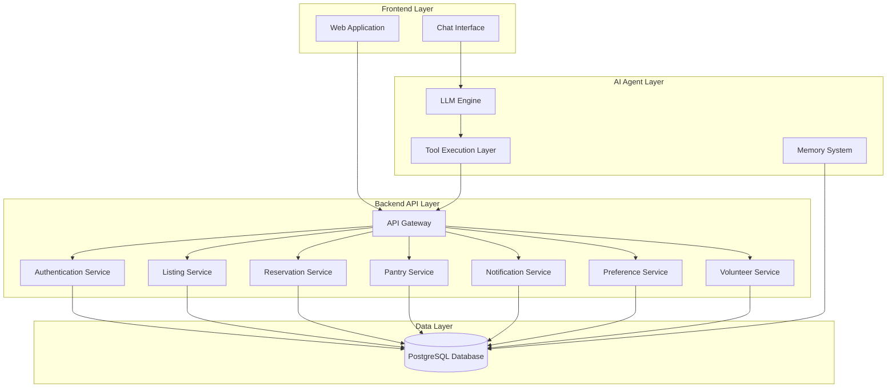
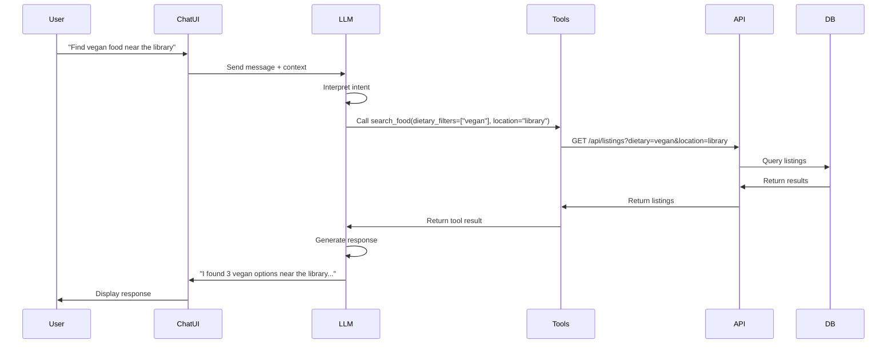
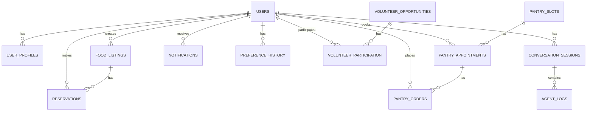

# Design Document: FoodBridge AI Platform

## Overview

FoodBridge AI is a full-stack web platform that connects students with food resources on campus while reducing food waste. The system consists of four primary layers:

1. **Frontend Layer**: Web application providing user interfaces for students and providers
2. **Backend API Layer**: RESTful API services handling business logic and data operations
3. **AI Agent Layer**: Conversational assistant with tool execution capabilities
4. **Data Layer**: Relational database storing all platform entities

The platform supports two primary user roles (Student and Provider) with distinct capabilities. Students can discover food, make reservations, book pantry appointments, and interact with an AI assistant. Providers can create food listings, manage donations, and track reservations.

The AI assistant acts as an intelligent interface layer, interpreting natural language requests and executing structured tool calls against the backend API. The assistant maintains conversational context and learns user preferences over time to provide personalized recommendations.

## Architecture

### System Architecture Diagram




### Technology Stack

**Frontend:**
- React or Vue.js for web application
- WebSocket or Server-Sent Events for real-time notifications
- HTTP client for API communication

**Backend:**
- Node.js with Express or Python with FastAPI
- JWT for authentication
- RESTful API design

**AI Agent:**
- OpenAI GPT-4 or Anthropic Claude for LLM reasoning
- Function calling / tool use capability
- Vector database (optional) for preference embeddings

**Database:**
- PostgreSQL for relational data storage
- Redis (optional) for session caching and rate limiting

**Storage:**
- Image storage: AWS S3, Supabase Storage, or local file storage
- Supports image uploads for food listings (max 5MB, jpg/png formats)
- Public URL generation for stored images

**Infrastructure:**
- Cloud hosting (AWS, GCP, or Azure)
- Container orchestration (Docker + Kubernetes optional)

## Components and Interfaces

### Frontend Components

**1. Authentication Module**
- Login/Registration forms
- Session management
- Role-based UI rendering

**2. Student Dashboard**
- Food listing browser
- Reservation manager
- Pantry appointment scheduler
- Notification center
- Profile settings

**3. Provider Dashboard**
- Food donation form
- Listing management interface
- Reservation viewer
- Analytics dashboard

**4. AI Chat Interface**
- Message input/output
- Tool execution feedback
- Suggested actions display
- Smart cart preview

### Backend Services

**1. Authentication Service**

Responsibilities:
- User registration and login
- JWT token generation and validation
- Password hashing and verification
- Role-based access control

API Endpoints:
- `POST /api/auth/register` - Create new user account
- `POST /api/auth/login` - Authenticate user and return JWT
- `POST /api/auth/logout` - Invalidate session
- `GET /api/auth/me` - Get current user profile

**2. Listing Service**

Responsibilities:
- Create, read, update, delete food listings
- Manage listing status (active, expired, completed)
- Filter and search listings
- Track available quantities

API Endpoints:
- `POST /api/listings` - Create new food listing (Provider only)
- `GET /api/listings` - Search and filter food listings with pagination (supports query params: page, limit, dietary, location, food_type)
- `GET /api/listings/:id` - Get specific listing details
- `PUT /api/listings/:id` - Update listing (Provider only)
- `DELETE /api/listings/:id` - Delete listing (Provider only)
- `GET /api/listings/provider/:providerId` - Get provider's listings
- `PATCH /api/listings/:id/status` - Update listing status

Pagination Response Format:
```json
{
  "data": [...],
  "pagination": {
    "total_count": 150,
    "page": 1,
    "limit": 20,
    "total_pages": 8
  }
}
```

**3. Reservation Service**

Responsibilities:
- Create and cancel reservations
- Validate quantity availability
- Prevent duplicate reservations
- Track reservation history

API Endpoints:
- `POST /api/reservations` - Create new reservation (Student only)
- `GET /api/reservations/student/:studentId` - Get student's reservations
- `GET /api/reservations/listing/:listingId` - Get listing's reservations (Provider only)
- `DELETE /api/reservations/:id` - Cancel reservation

**4. Pantry Service**

Responsibilities:
- Manage pantry time slots
- Book and cancel appointments
- Track pantry orders
- Generate smart pantry carts

API Endpoints:
- `GET /api/pantry/slots` - Get available time slots
- `POST /api/pantry/appointments` - Book pantry appointment (Student only)
- `GET /api/pantry/appointments/student/:studentId` - Get student's appointments
- `DELETE /api/pantry/appointments/:id` - Cancel appointment
- `POST /api/pantry/orders` - Create pantry order
- `GET /api/pantry/cart/generate` - Generate smart pantry cart based on preferences


**5. Notification Service**

Responsibilities:
- Send notifications based on user preferences
- Track notification delivery
- Filter notifications by type
- Support multiple notification channels

API Endpoints:
- `GET /api/notifications/user/:userId` - Get user's notifications
- `POST /api/notifications` - Create notification (internal)
- `PATCH /api/notifications/:id/read` - Mark notification as read
- `DELETE /api/notifications/:id` - Delete notification

**6. Preference Service**

Responsibilities:
- Store and retrieve user preferences
- Track user behavior (selections, reservations)
- Analyze preference patterns
- Generate recommendations

API Endpoints:
- `GET /api/preferences/user/:userId` - Get user preferences
- `PUT /api/preferences/user/:userId` - Update user preferences
- `POST /api/preferences/track` - Record user behavior event
- `GET /api/preferences/frequent-items/:userId` - Get frequently selected items
- `GET /api/preferences/recommendations/:userId` - Get personalized recommendations

**7. Volunteer Service**

Responsibilities:
- Manage volunteer opportunities
- Track volunteer participation
- Enforce volunteer limits

API Endpoints:
- `GET /api/volunteer/opportunities` - Get available volunteer tasks
- `POST /api/volunteer/signup` - Sign up for volunteer task (Student only)
- `GET /api/volunteer/participation/:studentId` - Get student's volunteer history
- `DELETE /api/volunteer/signup/:id` - Cancel volunteer signup

**8. Dining Service**

Responsibilities:
- Manage dining deals and discounts
- Track deal expiration
- Filter deals by restaurant

API Endpoints:
- `POST /api/dining/deals` - Create dining deal (Provider only)
- `GET /api/dining/deals` - Get active dining deals with pagination
- `GET /api/dining/deals/:id` - Get specific deal details
- `DELETE /api/dining/deals/:id` - Remove dining deal (Provider only)

**9. Health Monitoring Service**

Responsibilities:
- Monitor system health and availability
- Check database connectivity
- Verify AI service availability
- Provide uptime status

API Endpoints:
- `GET /health` - Get system health status (public, no authentication required)

Health Response Format:
```json
{
  "status": "ok" | "degraded" | "down",
  "timestamp": "2026-03-10T12:00:00Z",
  "services": {
    "database": "connected" | "disconnected",
    "ai_service": "available" | "unavailable"
  }
}
```

### AI Agent Components

**1. LLM Engine**

Responsibilities:
- Interpret user intent from natural language
- Select appropriate tools to execute
- Generate conversational responses
- Maintain conversational context

Implementation:
- Use OpenAI GPT-4 or Anthropic Claude with function calling
- System prompt defines agent role and capabilities
- Temperature set to 0.3-0.5 for consistent tool selection
- Max tokens configured for concise responses
- Rate limiting applied: 20 requests per minute per user

**2. Tool Execution Layer**

The tool layer provides structured functions that the LLM can invoke. Each tool maps to one or more backend API endpoints.

**Tool Definitions:**

```typescript
interface Tool {
  name: string;
  description: string;
  parameters: {
    type: "object";
    properties: Record<string, any>;
    required: string[];
  };
}
```

**Available Tools:**

1. **search_food**
   - Description: Search for available food listings with optional filters
   - Parameters: `{ dietary_filters?: string[], location?: string, food_type?: string }`
   - Maps to: `GET /api/listings`

2. **reserve_food**
   - Description: Reserve a specific food listing
   - Parameters: `{ listing_id: string, quantity: number }`
   - Maps to: `POST /api/reservations`

3. **get_pantry_slots**
   - Description: Get available pantry appointment time slots
   - Parameters: `{}`
   - Maps to: `GET /api/pantry/slots`

4. **book_pantry**
   - Description: Book a pantry appointment
   - Parameters: `{ slot_id: string }`
   - Maps to: `POST /api/pantry/appointments`

5. **get_notifications**
   - Description: Retrieve recent notifications for the user
   - Parameters: `{ limit?: number }`
   - Maps to: `GET /api/notifications/user/:userId`

6. **get_dining_deals**
   - Description: Get available dining discounts and deals
   - Parameters: `{ restaurant?: string }`
   - Maps to: `GET /api/dining/deals`

7. **get_event_food**
   - Description: Get food available from campus events
   - Parameters: `{}`
   - Maps to: `GET /api/listings?type=event`

8. **suggest_recipes**
   - Description: Suggest recipes using available pantry items
   - Parameters: `{ ingredients: string[] }`
   - Implementation: LLM-generated suggestions based on ingredients

9. **retrieve_user_preferences**
   - Description: Get user's dietary preferences and restrictions
   - Parameters: `{}`
   - Maps to: `GET /api/preferences/user/:userId`

10. **get_frequent_pantry_items**
    - Description: Get items the user frequently selects from pantry
    - Parameters: `{}`
    - Maps to: `GET /api/preferences/frequent-items/:userId`

11. **generate_pantry_cart**
    - Description: Generate recommended pantry order based on history
    - Parameters: `{}`
    - Maps to: `GET /api/pantry/cart/generate`


**3. Memory System**

The memory system has two components:

**Short-Term Memory (Conversational Context):**
- Stored in-memory or Redis cache
- Keyed by session ID
- Contains recent messages and tool execution results
- Expires after session timeout (30 minutes of inactivity)
- Enables pronoun resolution and follow-up questions

**Long-Term Memory (Preference History):**
- Stored in PostgreSQL database
- Tracks user behavior across sessions:
  - Pantry items selected
  - Food reservations made
  - Dietary filters applied
  - Restaurants visited
- Used for generating recommendations and smart carts
- Persists indefinitely unless user deletes account

**Agent Workflow:**



## Data Models

### Database Schema

**Users Table**
```sql
CREATE TABLE users (
  user_id UUID PRIMARY KEY DEFAULT gen_random_uuid(),
  email VARCHAR(255) UNIQUE NOT NULL,
  password_hash VARCHAR(255) NOT NULL,
  role VARCHAR(20) NOT NULL CHECK (role IN ('student', 'provider', 'admin')),
  created_at TIMESTAMP DEFAULT CURRENT_TIMESTAMP,
  updated_at TIMESTAMP DEFAULT CURRENT_TIMESTAMP
);
```

**User Profiles Table**
```sql
CREATE TABLE user_profiles (
  profile_id UUID PRIMARY KEY DEFAULT gen_random_uuid(),
  user_id UUID REFERENCES users(user_id) ON DELETE CASCADE,
  dietary_preferences TEXT[],
  allergies TEXT[],
  preferred_food_types TEXT[],
  notification_preferences JSONB,
  created_at TIMESTAMP DEFAULT CURRENT_TIMESTAMP,
  updated_at TIMESTAMP DEFAULT CURRENT_TIMESTAMP
);
```

**Food Listings Table**
```sql
CREATE TABLE food_listings (
  listing_id UUID PRIMARY KEY DEFAULT gen_random_uuid(),
  provider_id UUID REFERENCES users(user_id) ON DELETE CASCADE,
  food_name VARCHAR(255) NOT NULL,
  description TEXT,
  quantity INTEGER NOT NULL CHECK (quantity >= 0),
  available_quantity INTEGER NOT NULL CHECK (available_quantity >= 0),
  location VARCHAR(255) NOT NULL,
  pickup_window_start TIMESTAMP NOT NULL,
  pickup_window_end TIMESTAMP NOT NULL,
  food_type VARCHAR(50),
  dietary_tags TEXT[],
  listing_type VARCHAR(20) DEFAULT 'donation' CHECK (listing_type IN ('donation', 'event', 'dining_deal')),
  status VARCHAR(20) DEFAULT 'active' CHECK (status IN ('active', 'expired', 'completed', 'unavailable')),
  created_at TIMESTAMP DEFAULT CURRENT_TIMESTAMP,
  updated_at TIMESTAMP DEFAULT CURRENT_TIMESTAMP,
  CONSTRAINT valid_pickup_window CHECK (pickup_window_end > pickup_window_start)
);
```

**Reservations Table**
```sql
CREATE TABLE reservations (
  reservation_id UUID PRIMARY KEY DEFAULT gen_random_uuid(),
  listing_id UUID REFERENCES food_listings(listing_id) ON DELETE CASCADE,
  student_id UUID REFERENCES users(user_id) ON DELETE CASCADE,
  quantity INTEGER NOT NULL CHECK (quantity > 0),
  status VARCHAR(20) DEFAULT 'active' CHECK (status IN ('active', 'cancelled', 'completed')),
  created_at TIMESTAMP DEFAULT CURRENT_TIMESTAMP,
  updated_at TIMESTAMP DEFAULT CURRENT_TIMESTAMP,
  UNIQUE(listing_id, student_id)
);
```

**Pantry Slots Table**
```sql
CREATE TABLE pantry_slots (
  slot_id UUID PRIMARY KEY DEFAULT gen_random_uuid(),
  slot_time TIMESTAMP NOT NULL UNIQUE,
  is_booked BOOLEAN DEFAULT FALSE,
  created_at TIMESTAMP DEFAULT CURRENT_TIMESTAMP
);
```

**Pantry Appointments Table**
```sql
CREATE TABLE pantry_appointments (
  appointment_id UUID PRIMARY KEY DEFAULT gen_random_uuid(),
  student_id UUID REFERENCES users(user_id) ON DELETE CASCADE,
  slot_id UUID REFERENCES pantry_slots(slot_id) ON DELETE CASCADE,
  status VARCHAR(20) DEFAULT 'scheduled' CHECK (status IN ('scheduled', 'completed', 'cancelled')),
  created_at TIMESTAMP DEFAULT CURRENT_TIMESTAMP,
  updated_at TIMESTAMP DEFAULT CURRENT_TIMESTAMP
);
```

**Pantry Orders Table**
```sql
CREATE TABLE pantry_orders (
  order_id UUID PRIMARY KEY DEFAULT gen_random_uuid(),
  student_id UUID REFERENCES users(user_id) ON DELETE CASCADE,
  appointment_id UUID REFERENCES pantry_appointments(appointment_id) ON DELETE SET NULL,
  items JSONB NOT NULL,
  status VARCHAR(20) DEFAULT 'pending' CHECK (status IN ('pending', 'completed', 'cancelled')),
  created_at TIMESTAMP DEFAULT CURRENT_TIMESTAMP,
  updated_at TIMESTAMP DEFAULT CURRENT_TIMESTAMP
);
```

**Pantry Inventory Table**
```sql
CREATE TABLE pantry_inventory (
  item_id UUID PRIMARY KEY DEFAULT gen_random_uuid(),
  item_name VARCHAR(255) NOT NULL,
  category VARCHAR(100),
  quantity INTEGER NOT NULL CHECK (quantity >= 0),
  in_stock BOOLEAN GENERATED ALWAYS AS (quantity > 0) STORED,
  unit VARCHAR(50),
  created_at TIMESTAMP DEFAULT CURRENT_TIMESTAMP,
  updated_at TIMESTAMP DEFAULT CURRENT_TIMESTAMP
);
```


**Notifications Table**
```sql
CREATE TABLE notifications (
  notification_id UUID PRIMARY KEY DEFAULT gen_random_uuid(),
  user_id UUID REFERENCES users(user_id) ON DELETE CASCADE,
  type VARCHAR(50) NOT NULL,
  message TEXT NOT NULL,
  is_read BOOLEAN DEFAULT FALSE,
  created_at TIMESTAMP DEFAULT CURRENT_TIMESTAMP
);
```

**Preference History Table**
```sql
CREATE TABLE preference_history (
  history_id UUID PRIMARY KEY DEFAULT gen_random_uuid(),
  user_id UUID REFERENCES users(user_id) ON DELETE CASCADE,
  event_type VARCHAR(50) NOT NULL,
  event_data JSONB NOT NULL,
  created_at TIMESTAMP DEFAULT CURRENT_TIMESTAMP
);
```

**Volunteer Opportunities Table**
```sql
CREATE TABLE volunteer_opportunities (
  opportunity_id UUID PRIMARY KEY DEFAULT gen_random_uuid(),
  title VARCHAR(255) NOT NULL,
  description TEXT,
  max_volunteers INTEGER NOT NULL,
  current_volunteers INTEGER DEFAULT 0,
  event_date TIMESTAMP NOT NULL,
  status VARCHAR(20) DEFAULT 'open' CHECK (status IN ('open', 'closed', 'completed')),
  created_at TIMESTAMP DEFAULT CURRENT_TIMESTAMP,
  updated_at TIMESTAMP DEFAULT CURRENT_TIMESTAMP
);
```

**Volunteer Participation Table**
```sql
CREATE TABLE volunteer_participation (
  participation_id UUID PRIMARY KEY DEFAULT gen_random_uuid(),
  opportunity_id UUID REFERENCES volunteer_opportunities(opportunity_id) ON DELETE CASCADE,
  student_id UUID REFERENCES users(user_id) ON DELETE CASCADE,
  status VARCHAR(20) DEFAULT 'signed_up' CHECK (status IN ('signed_up', 'completed', 'cancelled')),
  created_at TIMESTAMP DEFAULT CURRENT_TIMESTAMP,
  updated_at TIMESTAMP DEFAULT CURRENT_TIMESTAMP,
  UNIQUE(opportunity_id, student_id)
);
```

**Conversation Sessions Table**
```sql
CREATE TABLE conversation_sessions (
  session_id UUID PRIMARY KEY DEFAULT gen_random_uuid(),
  user_id UUID REFERENCES users(user_id) ON DELETE CASCADE,
  messages JSONB NOT NULL,
  last_activity TIMESTAMP DEFAULT CURRENT_TIMESTAMP,
  created_at TIMESTAMP DEFAULT CURRENT_TIMESTAMP
);
```

**Agent Logs Table**
```sql
CREATE TABLE agent_logs (
  log_id UUID PRIMARY KEY DEFAULT gen_random_uuid(),
  user_id UUID REFERENCES users(user_id) ON DELETE SET NULL,
  session_id UUID REFERENCES conversation_sessions(session_id) ON DELETE SET NULL,
  query TEXT,
  tool_calls JSONB,
  response TEXT,
  execution_time_ms INTEGER,
  error TEXT,
  created_at TIMESTAMP DEFAULT CURRENT_TIMESTAMP
);
```

### Entity Relationships



### Data Access Patterns

**High-Frequency Queries:**
1. Get active food listings with filters (search)
2. Get user's active reservations
3. Get available pantry slots
4. Get user's recent notifications
5. Get user preferences and frequent items

**Optimization Strategies:**
- Index on `food_listings.status`, `food_listings.pickup_window_start`, `food_listings.listing_type`
- Index on `reservations.student_id`, `reservations.listing_id`
- Index on `pantry_slots.slot_time`, `pantry_slots.is_booked`
- Index on `notifications.user_id`, `notifications.created_at`
- Index on `preference_history.user_id`, `preference_history.event_type`
- Composite index on `food_listings(status, pickup_window_start)` for active listing queries


## Correctness Properties

A property is a characteristic or behavior that should hold true across all valid executions of a system—essentially, a formal statement about what the system should do. Properties serve as the bridge between human-readable specifications and machine-verifiable correctness guarantees.

### Authentication and Authorization Properties

**Property 1: User registration creates accounts with specified roles**
*For any* valid user registration data with a specified role (Student or Provider), creating an account should result in a user record with that exact role persisted in the database.
**Validates: Requirements 1.1**

**Property 2: Valid credentials authenticate successfully**
*For any* user account, logging in with the correct email and password should result in successful authentication and a valid session token.
**Validates: Requirements 1.2**

**Property 3: Invalid credentials are rejected**
*For any* login attempt with incorrect credentials, the authentication system should reject the attempt and return an error without creating a session.
**Validates: Requirements 1.3**

**Property 4: Role-based access control is enforced**
*For any* user with role R, attempting to access endpoints restricted to role R' (where R ≠ R') should result in a 403 authorization error.
**Validates: Requirements 1.4, 1.5**

### Profile Management Properties

**Property 5: Profile updates are persisted (round-trip)**
*For any* user profile and any valid profile update, applying the update then retrieving the profile should return the updated values.
**Validates: Requirements 2.1, 2.3**

**Property 6: Profile contains required preference fields**
*For any* user profile, the profile should contain dietary_preferences, allergies, and preferred_food_types fields.
**Validates: Requirements 2.2**

**Property 7: Notification preferences filter notifications**
*For any* user who disables a notification type T, no notifications of type T should be sent to that user.
**Validates: Requirements 2.4, 8.5**

### Food Listing Properties

**Property 8: Food listings contain required fields**
*For any* created food listing, the listing should contain food_name, quantity, location, pickup_window_start, pickup_window_end, and provider_id.
**Validates: Requirements 3.1**

**Property 9: Listing updates are persisted with timestamp changes**
*For any* food listing and any valid update, applying the update should persist the changes and result in a newer updated_at timestamp.
**Validates: Requirements 3.2**

**Property 10: Deleted listings are not retrievable**
*For any* food listing, after deletion, attempting to retrieve the listing by ID should return a not-found error.
**Validates: Requirements 3.3**

**Property 11: Search returns only active future listings**
*For any* search query without filters, all returned listings should have status='active' and pickup_window_end >= current_time.
**Validates: Requirements 3.4**

**Property 12: Expired listings are marked as expired**
*For any* food listing where pickup_window_end < current_time, the listing status should be 'expired'.
**Validates: Requirements 3.5, 19.3**

**Property 13: Pickup windows must be in the future**
*For any* food listing creation or update, if pickup_window_start <= current_time, the operation should be rejected with a validation error.
**Validates: Requirements 16.2**

**Property 14: Zero quantity marks listing unavailable**
*For any* food listing, when available_quantity reaches 0, the listing status should automatically change to 'unavailable'.
**Validates: Requirements 16.4**

### Reservation Properties

**Property 15: Reservations link students to listings**
*For any* successful reservation, the reservation record should contain valid foreign keys to both the student and the listing.
**Validates: Requirements 4.1**

**Property 16: Reservations decrease available quantity (invariant)**
*For any* food listing, available_quantity should equal original_quantity minus the sum of all active reservation quantities for that listing.
**Validates: Requirements 4.2**

**Property 17: Reservations cannot exceed available quantity**
*For any* reservation attempt where requested_quantity > listing.available_quantity, the reservation should be rejected with an error.
**Validates: Requirements 4.3**

**Property 18: Students can retrieve all their reservations**
*For any* student, querying their reservations should return all reservation records where student_id matches and status='active'.
**Validates: Requirements 4.4**

**Property 19: Canceling reservations restores quantity (round-trip)**
*For any* reservation, creating then immediately canceling the reservation should restore the listing's available_quantity to its original value.
**Validates: Requirements 4.5**

**Property 20: Duplicate reservations are prevented**
*For any* student and listing, attempting to create a second reservation for the same listing should be rejected with a uniqueness error.
**Validates: Requirements 4.6**

### Pantry Appointment Properties

**Property 21: Available slots query returns only unbooked slots**
*For any* query for available pantry slots, all returned slots should have is_booked=false.
**Validates: Requirements 5.1**

**Property 22: Booking appointments marks slots as booked**
*For any* successful pantry appointment booking, the corresponding slot should have is_booked=true and an appointment record should exist.
**Validates: Requirements 5.2**

**Property 23: Double-booking is prevented**
*For any* pantry slot where is_booked=true, attempting to book that slot should be rejected with an error.
**Validates: Requirements 5.3**

**Property 24: Students can retrieve their appointments**
*For any* student, querying their appointments should return all appointment records where student_id matches and status='scheduled'.
**Validates: Requirements 5.4**

**Property 25: Canceling appointments restores slot availability (round-trip)**
*For any* pantry appointment, booking then immediately canceling should restore the slot's is_booked status to false.
**Validates: Requirements 5.5**


### Preference Learning Properties

**Property 26: User actions are recorded in preference history**
*For any* user action (pantry item selection, reservation, dietary filter application), a corresponding record should be created in the preference_history table.
**Validates: Requirements 7.1, 7.2, 7.3**

**Property 27: Preference retrieval returns aggregated data**
*For any* user with preference history, retrieving preferences should return dietary restrictions, frequently selected items, and preferred restaurants based on historical data.
**Validates: Requirements 7.4**

**Property 28: Smart cart generation includes frequent items**
*For any* user with pantry selection history, generating a smart cart should include items that appear in multiple previous sessions.
**Validates: Requirements 7.5, 13.2**

**Property 29: Frequency affects recommendation priority**
*For any* two items A and B in a user's history, if A appears in more sessions than B, then A should rank higher in recommendations than B.
**Validates: Requirements 7.6**

### Notification Properties

**Property 30: New listings trigger targeted notifications**
*For any* new food listing with food_type T, notifications should be sent to all users who have T in their preferred_food_types.
**Validates: Requirements 8.1**

**Property 31: Reservations trigger confirmation notifications**
*For any* successful reservation, a confirmation notification should be created for the student who made the reservation.
**Validates: Requirements 8.2**

**Property 32: Pantry bookings trigger confirmation notifications**
*For any* successful pantry appointment booking, a confirmation notification should be created for the student who booked it.
**Validates: Requirements 8.3**

**Property 33: Upcoming appointments trigger reminder notifications**
*For any* pantry appointment where slot_time is within the reminder window, a reminder notification should be created for the student.
**Validates: Requirements 8.4**

**Property 34: Notifications are ordered by timestamp descending**
*For any* user's notification query, the returned notifications should be ordered with the most recent notification first.
**Validates: Requirements 8.6**

### Search and Filtering Properties

**Property 35: Unfiltered search returns all active listings**
*For any* search query with no filters, all active listings should be returned.
**Validates: Requirements 10.1**

**Property 36: Filters are correctly applied**
*For any* search query with filters F, all returned listings should match all conditions specified in F (dietary requirements, location, food type).
**Validates: Requirements 10.2, 10.3, 10.4**

**Property 37: Search results are ordered by pickup time**
*For any* search query, returned listings should be ordered by pickup_window_start in ascending order.
**Validates: Requirements 10.5**

### Database CRUD Properties

**Property 38: Created entities have unique identifiers**
*For any* entity creation, the created entity should have a unique ID that differs from all other entities of the same type.
**Validates: Requirements 11.1**

**Property 39: Entity updates persist and update timestamps**
*For any* entity and valid update, applying the update should persist changes and result in updated_at > previous updated_at.
**Validates: Requirements 11.2**

**Property 40: Entity retrieval by ID (round-trip)**
*For any* created entity, querying by its ID should return an entity with identical field values.
**Validates: Requirements 11.3**

**Property 41: Deleted entities are not retrievable**
*For any* entity, after deletion, querying by its ID should return a not-found error.
**Validates: Requirements 11.4**

**Property 42: Referential integrity is maintained**
*For any* entity with foreign key relationships, deleting a referenced entity should either cascade delete dependent entities or prevent deletion based on the constraint configuration.
**Validates: Requirements 11.5**

### API Security Properties

**Property 43: Unauthenticated requests are rejected**
*For any* API request without an authentication token, the request should be rejected with a 401 error.
**Validates: Requirements 14.1**

**Property 44: Invalid authentication is rejected**
*For any* API request with an invalid or expired token, the request should be rejected with a 401 error.
**Validates: Requirements 14.2**

**Property 45: Invalid input data is rejected with validation details**
*For any* API request with data that violates the expected schema, the request should be rejected with a 400 error and specific validation error messages.
**Validates: Requirements 14.3**

**Property 46: Unauthorized actions are rejected**
*For any* API request attempting an action the user is not authorized to perform, the request should be rejected with a 403 error.
**Validates: Requirements 14.4**

**Property 47: Input validation occurs before processing**
*For any* API request, schema validation should occur before any business logic is executed.
**Validates: Requirements 14.5**

### Logging Properties

**Property 48: System events are comprehensively logged**
*For any* significant system event (user query, tool execution, response generation, error), a corresponding log entry should be created with timestamp, user context, and event details.
**Validates: Requirements 15.1, 15.2, 15.3, 15.4**

### Provider and Dining Properties

**Property 49: Provider donations create listings with metadata**
*For any* provider donation submission, a food listing should be created with the provider's user_id as provider_id.
**Validates: Requirements 16.1**

**Property 50: Marking food as collected updates status**
*For any* food listing, when marked as collected by the provider, the status should change to 'completed'.
**Validates: Requirements 16.3**

**Property 51: Providers can view all reservations for their listings**
*For any* provider and their listing, querying reservations for that listing should return all reservation records with quantities and timestamps.
**Validates: Requirements 17.1, 17.2**

**Property 52: Dining deals are created and filtered correctly**
*For any* dining deal creation, a food listing with listing_type='dining_deal' should be created, and searching dining deals should return only listings with this type and status='active'.
**Validates: Requirements 18.1, 18.3**

**Property 53: Expired dining deals are removed from active listings**
*For any* dining deal where pickup_window_end < current_time, the deal should not appear in active dining deal searches.
**Validates: Requirements 18.2**

### Event Food Properties

**Property 54: Event food is tagged correctly**
*For any* event food listing creation, the listing should have listing_type='event' or appropriate event tag.
**Validates: Requirements 19.1**

**Property 55: Event food search returns only event listings**
*For any* search query for event food, all returned listings should have the event tag or listing_type='event'.
**Validates: Requirements 19.2**

### Volunteer Properties

**Property 56: Volunteer opportunities are listable**
*For any* query for volunteer opportunities, all opportunities with status='open' should be returned.
**Validates: Requirements 20.1**

**Property 57: Volunteer signups are recorded**
*For any* successful volunteer signup, a participation record should be created linking the student to the opportunity.
**Validates: Requirements 20.2**

**Property 58: Volunteer tasks close when full**
*For any* volunteer opportunity, when current_volunteers reaches max_volunteers, the status should change to 'closed'.
**Validates: Requirements 20.3**

### AI Assistant Session Properties

**Property 59: New sessions initialize with empty context**
*For any* new conversation session, the short-term context should be empty with no previous messages.
**Validates: Requirements 9.3**

**Property 60: Session context persists during active session**
*For any* active conversation session, messages and context should be retrievable throughout the session duration.
**Validates: Requirements 9.4**

### Smart Pantry Cart Properties

**Property 61: Confirmed carts create pantry orders**
*For any* generated smart pantry cart, when the user confirms it, a pantry order should be created with the recommended items.
**Validates: Requirements 13.4**

**Property 62: Cart modifications are applied to orders**
*For any* generated smart pantry cart, when the user modifies items before confirming, the created order should reflect the user's modifications.
**Validates: Requirements 13.5**


## Error Handling

### Error Categories

**1. Authentication Errors (401)**
- Invalid credentials
- Expired tokens
- Missing authentication headers

Response format:
```json
{
  "error": "Unauthorized",
  "message": "Invalid or expired authentication token",
  "code": "AUTH_INVALID_TOKEN"
}
```

**2. Authorization Errors (403)**
- Role-based access violations
- Attempting to access other users' resources
- Provider-only or student-only endpoint violations

Response format:
```json
{
  "error": "Forbidden",
  "message": "You do not have permission to perform this action",
  "code": "AUTH_INSUFFICIENT_PERMISSIONS"
}
```

**3. Validation Errors (400)**
- Invalid input data
- Schema violations
- Business rule violations (e.g., quantity exceeds available)

Response format:
```json
{
  "error": "Bad Request",
  "message": "Validation failed",
  "code": "VALIDATION_ERROR",
  "details": [
    {
      "field": "quantity",
      "message": "Quantity exceeds available amount"
    }
  ]
}
```

**4. Not Found Errors (404)**
- Resource does not exist
- Invalid IDs

Response format:
```json
{
  "error": "Not Found",
  "message": "Resource not found",
  "code": "RESOURCE_NOT_FOUND",
  "resource_type": "food_listing",
  "resource_id": "uuid"
}
```

**5. Conflict Errors (409)**
- Duplicate reservations
- Double-booking pantry slots
- Uniqueness constraint violations

Response format:
```json
{
  "error": "Conflict",
  "message": "Resource already exists or conflict detected",
  "code": "RESOURCE_CONFLICT",
  "details": "You have already reserved this food listing"
}
```

**6. Server Errors (500)**
- Database connection failures
- Unexpected exceptions
- LLM API failures

Response format:
```json
{
  "error": "Internal Server Error",
  "message": "An unexpected error occurred",
  "code": "INTERNAL_ERROR",
  "request_id": "uuid"
}
```

### AI Assistant Error Handling

**Tool Execution Failures:**
- When a tool call fails, the AI assistant should catch the error and generate a user-friendly explanation
- The assistant should suggest alternative actions when possible
- Example: "I couldn't reserve that food because it's no longer available. Would you like to see other options?"

**LLM API Failures:**
- Implement retry logic with exponential backoff (3 retries)
- If all retries fail, return a graceful error message to the user
- Log the failure for monitoring

**Timeout Handling:**
- Set timeout of 30 seconds for LLM requests
- If timeout occurs, inform user and suggest trying again
- Log timeout events for performance monitoring

### Database Error Handling

**Connection Failures:**
- Implement connection pooling with automatic reconnection
- Return 503 Service Unavailable if database is unreachable
- Log connection failures for alerting

**Transaction Failures:**
- Wrap multi-step operations in database transactions
- Rollback on any failure to maintain consistency
- Return appropriate error to user with explanation

**Constraint Violations:**
- Catch foreign key, unique, and check constraint violations
- Map to appropriate HTTP status codes (400 or 409)
- Provide clear error messages explaining the violation


## Testing Strategy

### Dual Testing Approach

The FoodBridge platform requires both unit testing and property-based testing for comprehensive coverage. These approaches are complementary:

- **Unit tests** verify specific examples, edge cases, and error conditions
- **Property tests** verify universal properties across all inputs

Together, they provide comprehensive coverage where unit tests catch concrete bugs and property tests verify general correctness.

### Property-Based Testing

**Framework Selection:**
- **JavaScript/TypeScript**: fast-check
- **Python**: Hypothesis

**Configuration:**
- Minimum 100 iterations per property test (due to randomization)
- Each property test must reference its design document property
- Tag format: `Feature: foodbridge-platform, Property {number}: {property_text}`

**Property Test Implementation:**

Each correctness property from the design document should be implemented as a single property-based test. For example:

```typescript
// Example property test using fast-check
import fc from 'fast-check';

// Feature: foodbridge-platform, Property 1: User registration creates accounts with specified roles
test('Property 1: User registration creates accounts with specified roles', async () => {
  await fc.assert(
    fc.asyncProperty(
      fc.record({
        email: fc.emailAddress(),
        password: fc.string({ minLength: 8 }),
        role: fc.constantFrom('student', 'provider')
      }),
      async (userData) => {
        const user = await authService.register(userData);
        expect(user.role).toBe(userData.role);
        expect(user.email).toBe(userData.email);
      }
    ),
    { numRuns: 100 }
  );
});
```

**Property Test Coverage:**

All 62 properties defined in the Correctness Properties section should be implemented as property-based tests. Priority properties include:

1. Authentication and authorization (Properties 1-4)
2. Reservation quantity invariants (Property 16)
3. Round-trip properties (Properties 5, 19, 25, 40)
4. Filter and search correctness (Properties 36, 37)
5. Referential integrity (Property 42)

### Unit Testing

**Framework Selection:**
- **JavaScript/TypeScript**: Jest or Vitest
- **Python**: pytest

**Unit Test Focus:**

Unit tests should focus on:

1. **Specific Examples**: Concrete scenarios that demonstrate correct behavior
2. **Edge Cases**: Boundary conditions and special cases
3. **Error Conditions**: Specific error scenarios and error message validation
4. **Integration Points**: Component interactions and API contracts

**Example Unit Tests:**

```typescript
// Specific example test
test('Student can reserve available food listing', async () => {
  const listing = await createTestListing({ quantity: 10 });
  const student = await createTestStudent();
  
  const reservation = await reservationService.reserve({
    listingId: listing.id,
    studentId: student.id,
    quantity: 2
  });
  
  expect(reservation).toBeDefined();
  expect(reservation.quantity).toBe(2);
  
  const updatedListing = await listingService.getById(listing.id);
  expect(updatedListing.availableQuantity).toBe(8);
});

// Edge case test
test('Reservation with quantity 0 is rejected', async () => {
  const listing = await createTestListing({ quantity: 10 });
  const student = await createTestStudent();
  
  await expect(
    reservationService.reserve({
      listingId: listing.id,
      studentId: student.id,
      quantity: 0
    })
  ).rejects.toThrow('Quantity must be greater than 0');
});

// Error condition test
test('Reservation exceeding available quantity returns 400 error', async () => {
  const listing = await createTestListing({ quantity: 5 });
  const student = await createTestStudent();
  
  const response = await request(app)
    .post('/api/reservations')
    .set('Authorization', `Bearer ${student.token}`)
    .send({
      listingId: listing.id,
      quantity: 10
    });
  
  expect(response.status).toBe(400);
  expect(response.body.code).toBe('VALIDATION_ERROR');
  expect(response.body.details[0].field).toBe('quantity');
});
```

### AI Assistant Testing

**Tool Execution Tests:**

Test each tool with specific scenarios:

```typescript
test('search_food tool returns filtered results', async () => {
  await createTestListing({ foodType: 'vegan', location: 'library' });
  await createTestListing({ foodType: 'vegetarian', location: 'cafeteria' });
  
  const result = await tools.search_food({
    dietary_filters: ['vegan'],
    location: 'library'
  });
  
  expect(result.length).toBe(1);
  expect(result[0].foodType).toBe('vegan');
  expect(result[0].location).toBe('library');
});
```

**Conversation Context Tests:**

Test context management with specific conversation examples:

```typescript
test('AI assistant maintains context across messages', async () => {
  const session = await createTestSession();
  
  // First message
  await assistant.processMessage(session.id, 'Show me vegan food');
  const listings = session.context.lastToolResult;
  
  // Follow-up message with pronoun reference
  const response = await assistant.processMessage(session.id, 'Reserve the first one');
  
  expect(response.toolCalls).toContainEqual({
    tool: 'reserve_food',
    params: { listing_id: listings[0].id }
  });
});
```

### Integration Testing

**API Integration Tests:**

Test complete API workflows:

```typescript
test('Complete reservation workflow', async () => {
  // Provider creates listing
  const provider = await createTestProvider();
  const listing = await request(app)
    .post('/api/listings')
    .set('Authorization', `Bearer ${provider.token}`)
    .send({
      foodName: 'Pizza',
      quantity: 10,
      location: 'Student Center',
      pickupWindowStart: futureDate(),
      pickupWindowEnd: futureDate(2)
    });
  
  // Student searches and finds listing
  const student = await createTestStudent();
  const searchResults = await request(app)
    .get('/api/listings')
    .set('Authorization', `Bearer ${student.token}`);
  
  expect(searchResults.body).toContainEqual(
    expect.objectContaining({ foodName: 'Pizza' })
  );
  
  // Student reserves food
  const reservation = await request(app)
    .post('/api/reservations')
    .set('Authorization', `Bearer ${student.token}`)
    .send({
      listingId: listing.body.listingId,
      quantity: 2
    });
  
  expect(reservation.status).toBe(201);
  
  // Provider views reservations
  const providerReservations = await request(app)
    .get(`/api/reservations/listing/${listing.body.listingId}`)
    .set('Authorization', `Bearer ${provider.token}`);
  
  expect(providerReservations.body.length).toBe(1);
  expect(providerReservations.body[0].quantity).toBe(2);
});
```

### Test Data Management

**Test Fixtures:**
- Create reusable test data factories for users, listings, reservations
- Use database transactions for test isolation
- Clean up test data after each test

**Test Database:**
- Use separate test database
- Reset database state between test suites
- Seed with minimal required data

### Coverage Goals

- **Unit Test Coverage**: Minimum 80% code coverage
- **Property Test Coverage**: All 62 properties implemented
- **Integration Test Coverage**: All critical user workflows
- **API Test Coverage**: All endpoints tested with success and error cases

### Continuous Integration

- Run all tests on every commit
- Fail builds if any test fails
- Generate coverage reports
- Run property tests with increased iterations (1000+) in CI for thorough validation
