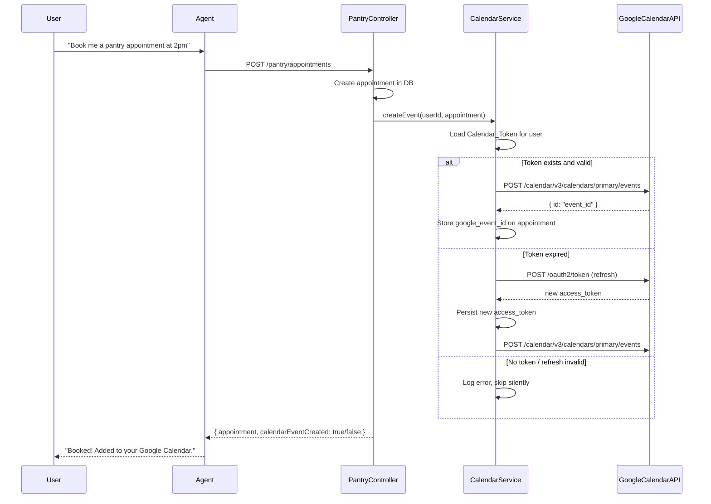
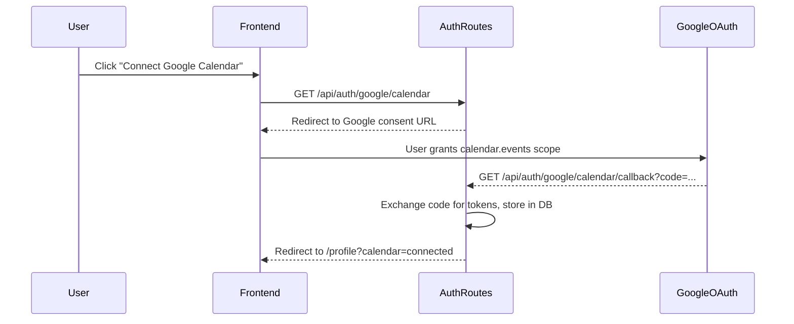

# Design Document: Google Calendar Integration

## Overview

This feature adds automatic Google Calendar synchronization to FoodBridge AI's pantry appointment booking flow. When the AI agent books a pantry appointment for a student, the backend Calendar_Service creates a corresponding Google Calendar event using the student's stored OAuth credentials. Students authorize the integration once via an OAuth 2.0 consent flow, and the connection is managed from their profile page.

The integration is designed to be non-blocking: a calendar failure never prevents a successful booking. The feature touches three layers — a new backend `CalendarService`, extensions to the pantry appointment controller and cancellation flow, and a small UI addition to the React profile page.

---

## Architecture





---

## Components and Interfaces

### Backend Components

#### `CalendarService` (`backend/src/services/calendarService.ts`)

The central service for all Google Calendar operations.

```typescript
interface CalendarTokenRecord {
  userId: string;
  accessToken: string;
  refreshToken: string;
  expiresAt: Date;
  isConnected: boolean;
}

interface CalendarEventInput {
  title: string;
  startTime: Date;
  endTime: Date;
  description?: string;
}

interface CreateEventResult {
  success: boolean;
  googleEventId?: string;
  error?: string;
}

class CalendarService {
  // Create a Google Calendar event for a user
  async createEvent(userId: string, event: CalendarEventInput): Promise<CreateEventResult>

  // Delete a Google Calendar event by its Google event ID
  async deleteEvent(userId: string, googleEventId: string): Promise<{ success: boolean; error?: string }>

  // Get a valid (possibly refreshed) access token for a user
  async getValidAccessToken(userId: string): Promise<string | null>

  // Disconnect a user's Google Calendar (delete stored tokens)
  async disconnectUser(userId: string): Promise<void>

  // Check if a user has a connected Google Calendar
  async isConnected(userId: string): Promise<boolean>
}
```

#### `CalendarTokenRepository` (`backend/src/repositories/calendarTokenRepository.ts`)

Handles persistence of OAuth tokens.

```typescript
class CalendarTokenRepository {
  async upsert(record: CalendarTokenRecord): Promise<void>
  async findByUserId(userId: string): Promise<CalendarTokenRecord | null>
  async updateAccessToken(userId: string, accessToken: string, expiresAt: Date): Promise<void>
  async deleteByUserId(userId: string): Promise<void>
}
```

#### OAuth Routes (`backend/src/routes/authRoutes.ts` — extended)

| Method | Path | Description |
|--------|------|-------------|
| GET | `/api/auth/google/calendar` | Initiates OAuth flow, redirects to Google consent URL |
| GET | `/api/auth/google/calendar/callback` | Handles OAuth callback, stores tokens, redirects to frontend |
| DELETE | `/api/auth/google/calendar` | Disconnects user's Google Calendar (deletes tokens) |
| GET | `/api/auth/google/calendar/status` | Returns `{ connected: boolean }` for the current user |

#### Pantry Appointment Controller (extended)

The existing `POST /pantry/appointments` handler is extended to call `CalendarService.createEvent` after a successful DB insert. The `google_event_id` returned is stored on the appointment row.

The existing `DELETE /pantry/appointments/cancel-by-datetime` handler is extended to call `CalendarService.deleteEvent` using the stored `google_event_id` before removing the appointment.

### Frontend Components

#### `GoogleCalendarConnect` (`foodbridge-frontend/src/components/profile/GoogleCalendarConnect.tsx`)

A self-contained React component rendered inside the existing `ProfilePage`. It:
- Fetches `/api/auth/google/calendar/status` on mount to determine connection state
- Renders "Connect Google Calendar" button (links to `/api/auth/google/calendar`) when disconnected
- Renders "Disconnect Google Calendar" button + connected indicator when connected
- Calls `DELETE /api/auth/google/calendar` on disconnect and updates local state

#### `calendarService` (`foodbridge-frontend/src/services/calendarService.ts`)

Frontend API client for calendar-related endpoints.

```typescript
const calendarService = {
  getStatus(): Promise<{ connected: boolean }>
  disconnect(): Promise<void>
}
```

---

## Data Models

### New Database Table: `google_calendar_tokens`

```sql
CREATE TABLE google_calendar_tokens (
  id            SERIAL PRIMARY KEY,
  user_id       INTEGER NOT NULL UNIQUE REFERENCES users(id) ON DELETE CASCADE,
  access_token  TEXT NOT NULL,
  refresh_token TEXT NOT NULL,
  expires_at    TIMESTAMPTZ NOT NULL,
  is_connected  BOOLEAN NOT NULL DEFAULT TRUE,
  created_at    TIMESTAMPTZ NOT NULL DEFAULT NOW(),
  updated_at    TIMESTAMPTZ NOT NULL DEFAULT NOW()
);
```

- One row per user, enforced by `UNIQUE` on `user_id`.
- `is_connected = false` means the refresh token was revoked; the row is kept to surface the disconnected state in the UI without requiring a re-fetch.
- Cascade delete ensures tokens are removed if the user account is deleted.

### Extended Table: `pantry_appointments`

```sql
ALTER TABLE pantry_appointments
  ADD COLUMN google_event_id TEXT;
```

- Nullable. Populated after a successful `CalendarService.createEvent` call.
- Used by the cancellation flow to identify which Google Calendar event to delete.

### Environment Variables

```
GOOGLE_CLIENT_ID=...
GOOGLE_CLIENT_SECRET=...
GOOGLE_REDIRECT_URI=http://localhost:3001/api/auth/google/calendar/callback
```

---

## Correctness Properties

*A property is a characteristic or behavior that should hold true across all valid executions of a system — essentially, a formal statement about what the system should do. Properties serve as the bridge between human-readable specifications and machine-verifiable correctness guarantees.*

### Property 1: Booking with connected calendar always attempts event creation

*For any* pantry appointment booking where the user has a valid Calendar_Token, the CalendarService.createEvent method should be called exactly once with the correct start time, end time, and title.

**Validates: Requirements 2.1, 2.2**

---

### Property 2: Calendar failure does not fail the booking

*For any* pantry appointment booking where CalendarService.createEvent throws or returns an error, the booking response should still indicate success and the appointment should exist in the database.

**Validates: Requirements 2.5**

---

### Property 3: Booking without connected calendar skips event creation

*For any* pantry appointment booking where the user has no Calendar_Token, CalendarService.createEvent should never be called.

**Validates: Requirements 2.4**

---

### Property 4: Token refresh preserves access

*For any* user whose access token has expired but whose refresh token is valid, calling `getValidAccessToken` should return a non-null token and the new access token should be persisted to the database.

**Validates: Requirements 3.1, 3.2**

---

### Property 5: Revoked refresh token disconnects user

*For any* user whose refresh token has been revoked, calling `getValidAccessToken` should return null and the user's `is_connected` flag should be set to false.

**Validates: Requirements 3.3**

---

### Property 6: Cancellation with connected calendar deletes event

*For any* cancelled pantry appointment that has a `google_event_id` and the user has a valid Calendar_Token, CalendarService.deleteEvent should be called with that `google_event_id`.

**Validates: Requirements 4.1**

---

### Property 7: Calendar deletion failure does not fail cancellation

*For any* pantry appointment cancellation where CalendarService.deleteEvent throws or returns an error, the cancellation response should still indicate success and the appointment should be removed from the database.

**Validates: Requirements 4.3**

---

### Property 8: OAuth token storage round-trip

*For any* valid OAuth token pair (access + refresh), storing it via `CalendarTokenRepository.upsert` and then retrieving it via `findByUserId` should return an equivalent record.

**Validates: Requirements 1.2**

---

### Property 9: Disconnect removes token and blocks calendar operations

*For any* user who disconnects their Google Calendar, subsequent calls to `CalendarService.isConnected` should return false, and `createEvent` should not call the Google Calendar API.

**Validates: Requirements 1.4**

---

## Error Handling

| Scenario | Behavior |
|----------|----------|
| Google OAuth callback with `error` param | Return 400 with descriptive message; no token stored |
| `createEvent` — Google API 401 (expired token) | Attempt token refresh; retry once; log and skip on second failure |
| `createEvent` — Google API 403 (scope revoked) | Mark `is_connected = false`; log; skip silently |
| `createEvent` — Google API 5xx / network error | Log error; skip silently; booking still succeeds |
| `deleteEvent` — Google API 404 (event not found) | Log warning; treat as success (event already gone) |
| `deleteEvent` — any other error | Log error; cancellation still succeeds |
| Refresh token exchange failure | Mark `is_connected = false`; return null from `getValidAccessToken` |

All calendar errors are logged via the existing `logger` utility at `backend/src/utils/logger.ts`. They are never surfaced to the user as booking or cancellation failures.

---

## Testing Strategy

### Unit Tests

Focus on specific examples and edge cases:

- `CalendarService.createEvent` — happy path with a valid token
- `CalendarService.createEvent` — token expired, refresh succeeds, event created
- `CalendarService.createEvent` — token expired, refresh fails, returns null gracefully
- `CalendarService.deleteEvent` — Google 404 treated as success
- `CalendarTokenRepository` — upsert creates new row; upsert on existing user updates row
- Pantry appointment controller — calendar error does not change HTTP response status
- OAuth callback handler — stores tokens correctly; handles `error` query param

### Property-Based Tests

Use `fast-check` (already used in the project) for universal property validation.

Each property test runs a minimum of 100 iterations.

**Tag format: `Feature: google-calendar-integration, Property {N}: {title}`**

| Property | Test Description |
|----------|-----------------|
| P1 | For any valid appointment input + connected user, createEvent is called with matching times |
| P2 | For any appointment booking where createEvent throws, booking result is still `success: true` |
| P3 | For any appointment booking where user has no token, createEvent is never invoked |
| P4 | For any expired-but-refreshable token, getValidAccessToken returns non-null and persists new token |
| P5 | For any revoked refresh token, getValidAccessToken returns null and sets is_connected = false |
| P6 | For any cancelled appointment with google_event_id + connected user, deleteEvent is called |
| P7 | For any cancellation where deleteEvent throws, cancellation result is still `success: true` |
| P8 | For any token record, upsert then findByUserId returns equivalent data |
| P9 | For any disconnected user, isConnected returns false and createEvent never calls Google API |

### Integration Tests

- Full OAuth flow: initiate → callback → status endpoint returns `connected: true`
- Full booking flow: book appointment → verify `google_event_id` stored on appointment row
- Full cancellation flow: cancel appointment → verify Google Calendar delete was called
- Disconnect flow: disconnect → status returns `connected: false` → booking skips calendar
